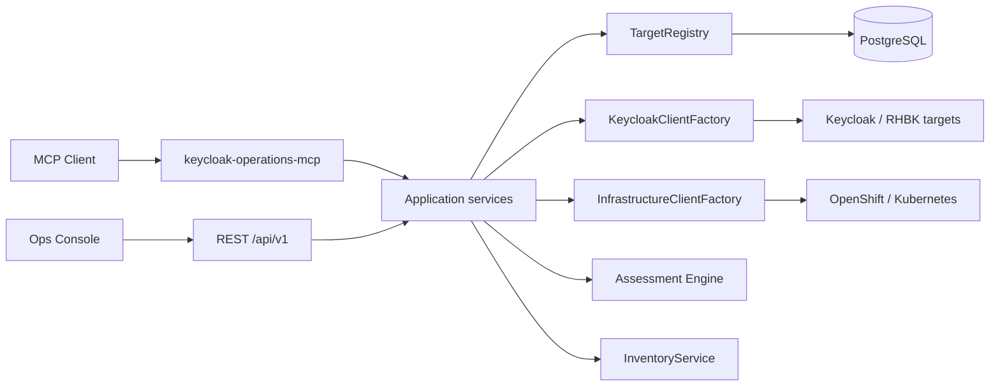

# Keycloak / RHBK Operations MCP

MCP Server for **administration**, **diagnostics**, **health**, and **assessment**
of [Keycloak](https://www.keycloak.org/) and
[Red Hat build of Keycloak (RHBK)](https://docs.redhat.com/en/documentation/red_hat_build_of_keycloak)
environments.

| | |
|---|---|
| Version | **0.5.0-SNAPSHOT** |
| Package | `io.github.keycloakmcp` |
| License | [Apache License 2.0](LICENSE) |
| MCP | Specification **2025-11-25** (Quarkiverse MCP Server **1.13.1**) |
| Runtime | Java **21**, Quarkus **3.38.1** |
| Repository | https://github.com/csfreitas/keycloak-operations |

## Overview

`keycloak-operations-mcp` exposes Keycloak Admin capabilities to AI agents and IDEs
through the Model Context Protocol. Version **0.1.0** focuses on a solid, read-only
operations foundation plus Assessment Engine architecture that can grow into HA,
security, capacity, and architecture assessments.

## Why MCP?

Operators and platform engineers already ask natural-language questions about realms,
clients, HA posture, and misconfigurations. MCP lets assistants call **structured,
auditable tools** instead of improvising shell/curl against Admin APIs — with
centralized redaction, least-privilege credentials, and reproducible evidence for
assessments.

## Architecture

See [docs/architecture.md](docs/architecture.md) for Mermaid diagrams covering
Administration, Assessment, and Security. Multi-target routing is documented in
[docs/multi-target.md](docs/multi-target.md).



Infrastructure discovery and inventory docs:
[docs/infrastructure-inventory.md](docs/infrastructure-inventory.md),
[docs/evidence-catalog.md](docs/evidence-catalog.md),
[docs/infrastructure-authentication.md](docs/infrastructure-authentication.md).

Assessment depth (0.5):
[docs/health-check.md](docs/health-check.md),
[docs/assessment-profiles.md](docs/assessment-profiles.md),
[docs/rule-catalog.md](docs/rule-catalog.md),
[docs/scoring.md](docs/scoring.md).

## Database

PostgreSQL holds targets (credential refs only), assessment/health history, audit events,
and environment snapshots. Flyway migrations start automatically.

```bash
podman compose -f dev/compose.yaml up -d postgres
export POSTGRES_JDBC_URL=jdbc:postgresql://localhost:5432/kcops
```

Docs: [docs/persistence.md](docs/persistence.md), [docs/database-schema.md](docs/database-schema.md).

## REST API

Operations Platform HTTP API under `/api/v1` (OpenAPI `/q/openapi`). Shares services
with MCP — tool signatures are unchanged.

Highlights: fleet, target overview, assessments, findings, health checks, snapshots,
semantic metrics, audit, SSE events.

Docs: [docs/rest-api.md](docs/rest-api.md), [docs/ui-architecture.md](docs/ui-architecture.md).

## Fleet

`GET /api/v1/fleet` combines registered targets with latest health/assessment signals
for a multi-environment dashboard. See [docs/ui/fleet-dashboard.md](docs/ui/fleet-dashboard.md).

## Persistence

Target registry modes (`platform.target-registry` / `mcp.target.registry`):

| Mode | Behavior |
|------|----------|
| `composite` (default) | Seed config → DB; prefer DB |
| `configuration` | Config only |
| `database` | DB only |

Audit persistence: `platform.audit.enabled`, mode `SANITIZED` by default.
No secrets in the database.
## Supported versions

| Product | Version | 0.1.0 status |
|---------|---------|--------------|
| Keycloak Community | 26.7.x | Local demo path (`26.7.1`) |
| Keycloak Community | 26.6.x | Design-compatible |
| RHBK | 26.6.x (26.6.5 noted) | Design-compatible; **not auto-tested** (needs `registry.redhat.io`) |

Details: [docs/compatibility.md](docs/compatibility.md).

### Dependencies verified on Maven Central (Aug 2026)

- Quarkus **3.38.1**
- Quarkiverse MCP Server **1.13.1**
- Keycloak Admin Client **26.0.12**
- Keycloak container **26.7.1** (Quay, local compose)

## Requirements

- Java 21+
- Maven 3.9+
- Podman or Docker with Compose
- `curl`, `jq` (setup / smoke scripts)

## Quick Start

```bash
podman compose -f dev/compose.yaml up -d
./scripts/setup-dev.sh
mvn clean verify
export LAB_KEYCLOAK_A_CLIENT_SECRET=change-me
export KEYCLOAK_CLIENT_SECRET=change-me
mvn quarkus:dev
```

Then connect an MCP client to `http://localhost:8081/mcp`, or run:

```bash
./scripts/smoke-mcp.sh
```

Prompt example: *Liste os ambientes disponíveis.* → `keycloak_list_targets`  
Then: *Liste os realms do lab-keycloak-a.* → `keycloak_list_realms` with `targetId=lab-keycloak-a`

## Multi-target architecture

One MCP server can manage many Keycloak/RHBK environments. Every admin tool
requires an explicit `targetId` (no silent production default). Endpoints and
secrets are **never** supplied by the LLM — only pre-registered targets.

See [docs/multi-target.md](docs/multi-target.md).

### Configuring targets

```properties
mcp.credentials.lab-a.client-secret=${LAB_KEYCLOAK_A_CLIENT_SECRET}
mcp.targets.lab-keycloak-a.keycloak.url=http://localhost:8080
mcp.targets.lab-keycloak-a.keycloak.credential-ref=lab-a
```

### Lab targets

| targetId | Port | Demo realm |
|----------|------|------------|
| `lab-keycloak-a` | 8080 | `mcp-demo` |
| `lab-keycloak-b` | 8180 (compose profile `multi-target`) | `company-b` |

```bash
podman compose -f dev/compose.yaml --profile multi-target up -d
KEYCLOAK_URL=http://localhost:8180 KEYCLOAK_HEALTH_URL=http://localhost:9002/health/ready ./scripts/setup-dev.sh
SMOKE_MULTI_TARGET=true ./scripts/smoke-mcp.sh
```

### Target security

- Tools accept only `targetId`, never URLs (SSRF protection)
- `credentialRef` and secrets are never returned to the LLM
- Audit logs include `targetId`
- Evidence / Findings are stamped with `targetId`

## Local Keycloak

Compose file: [`dev/compose.yaml`](dev/compose.yaml)

- Image: `quay.io/keycloak/keycloak:26.7.1`
- Ports: `8080` (HTTP), `9000` (management / health)
- Admin: `admin` / `admin`
- Realm import: [`dev/keycloak/import/mcp-demo-realm.json`](dev/keycloak/import/mcp-demo-realm.json)

Demo realm `mcp-demo` includes:

- Clients: `portal-web` (public), `backend-api` (confidential, secret `backend-api-secret` — local only)
- Users: `alice`/`alice`, `bob`/`bob`
- Roles: `user`, `admin`
- Groups: `users`, `administrators`

`scripts/setup-dev.sh` creates the `keycloak-mcp` client in `master` with a service
account. It grants broad roles for **DEV ONLY** — production must use FGAP / least
privilege, not master realm `admin`.

## Building

```bash
mvn clean verify
mvn package
```

## STDIO

```bash
mvn -Pstdio quarkus:dev
```

Example host config (env var references, no secrets):
[`.vscode/mcp.stdio.example.json`](.vscode/mcp.stdio.example.json)

## Streamable HTTP

Default mode. Quarkus listens on **8081**; MCP endpoint is **`/mcp`**.
Management (health/metrics) on **9001** (Keycloak compose uses host **9000**).

```bash
curl -s http://localhost:9001/q/health
./scripts/smoke-mcp.sh
```

## VS Code

[`.vscode/mcp.json`](.vscode/mcp.json):

```json
{
  "servers": {
    "keycloak-operations-mcp": {
      "type": "http",
      "url": "http://localhost:8081/mcp"
    }
  }
}
```

## Available Tools

See [docs/tools.md](docs/tools.md). Highlights:

| Tool | targetId | Notes |
|------|----------|-------|
| `keycloak_list_targets` / `keycloak_get_target` / `keycloak_find_targets` | — / required / — | Target discovery (sanitized) |
| `keycloak_server_info` | required | Product / version / capabilities |
| `keycloak_list_realms` / `keycloak_get_realm` | required | Realms |
| `keycloak_list_clients` / `keycloak_get_client` | required | Clients (no secrets) |
| `keycloak_search_users` / `keycloak_get_user` | required | Users |
| `keycloak_list_groups` / `keycloak_get_group` | required | Groups |
| `keycloak_list_roles` / `keycloak_get_role` | required | Roles |
| `keycloak_discover_environment` | required | Runtime discovery (0.1.x limited) |

## Authentication

OAuth2 **client credentials** per registered target. Secrets live under
`mcp.credentials.<ref>.client-secret` (e.g. `LAB_KEYCLOAK_A_CLIENT_SECRET`) and
are referenced via each target's `credential-ref`. The LLM never supplies URLs
or secrets.

## Security

- Read-only mode by default
- Secrets redacted from responses and logs
- Hardened OpenShift SecurityContext

See [docs/security.md](docs/security.md).

## Environment Discovery

When `discovery.kubernetes.enabled` and `discovery.openshift.enabled` are `false`
(default in tests), discovery returns `UNKNOWN` with explanatory evidence.
See [docs/environment-discovery.md](docs/environment-discovery.md).

## Assessment Architecture

Evidence → Rule → Finding → Score. Sample rule `KC-OCP-HA-001` flags
`deployment.replicas < 2` as severity **HIGH**.

Docs: [docs/assessment-engine.md](docs/assessment-engine.md),
[docs/rule-development.md](docs/rule-development.md).

## OpenShift Integration

Manifests under [`deploy/openshift/`](deploy/openshift/):

- Namespace, ServiceAccount `keycloak-mcp-assessor`
- Read-only ClusterRole / Binding
- ConfigMap, Secret **template**, Deployment, Service, Route, NetworkPolicy

Simplified Kubernetes: [`deploy/kubernetes/deployment.yaml`](deploy/kubernetes/deployment.yaml).

## Testing

```bash
mvn clean verify
./scripts/smoke-mcp.sh   # requires running MCP + Keycloak
```

Unit tests cover redaction, product/capability detection, services, discovery,
rule engine, and scoring. Integration matrix:
[integration-tests/README.md](integration-tests/README.md).

## Compatibility

Honest matrix in [docs/compatibility.md](docs/compatibility.md).
**RHBK is not auto-tested** without Red Hat registry credentials.

## Roadmap

0.1 admin read-only → 0.2 multi-target → **0.3 PostgreSQL / history / REST** → 0.4 OpenShift discovery →
0.5 assessment depth → 0.6 Prometheus → 0.7 Web UI → 0.8 snapshots/drift → 0.9 schedules/alerts → 1.0 platform.
See [docs/roadmap.md](docs/roadmap.md).

## Contributing

1. Use Java 21 and the Quick Start above
2. Keep tools read-only unless the roadmap milestone explicitly adds writes
3. Never commit secrets; use placeholders in deploy templates
4. Add unit tests for rules and redaction behavior
5. Document compatibility honestly — do not mark RHBK as tested without a real run

## Documentation index

- [Architecture](docs/architecture.md)
- [Multi-target](docs/multi-target.md)
- [Persistence](docs/persistence.md)
- [REST API](docs/rest-api.md)
- [Database schema](docs/database-schema.md)
- [Audit](docs/audit.md)
- [Snapshots](docs/snapshots.md)
- [Observability](docs/observability-integration.md)
- [UI architecture](docs/ui-architecture.md)
- [Identity model](docs/identity-model.md)
- [Fleet dashboard](docs/ui/fleet-dashboard.md)
- [Target overview UI](docs/ui/target-overview.md)
- [Assessment UI](docs/ui/assessment.md)
- [Infrastructure UI](docs/ui/infrastructure.md)
- [History UI](docs/ui/history.md)
- [Development](docs/development.md)
- [Tools](docs/tools.md)
- [Security](docs/security.md)
- [Compatibility](docs/compatibility.md)
- [Assessment engine](docs/assessment-engine.md)
- [Environment discovery](docs/environment-discovery.md)
- [Rule development](docs/rule-development.md)
- [Examples](docs/examples.md)
- [Roadmap](docs/roadmap.md)

| Doc | Topic |
|-----|-------|
| [docs/architecture.md](docs/architecture.md) | Architecture + Mermaid |
| [docs/persistence.md](docs/persistence.md) | PostgreSQL persistence |
| [docs/rest-api.md](docs/rest-api.md) | REST `/api/v1` |
| [docs/database-schema.md](docs/database-schema.md) | Schema / ER |
| [docs/audit.md](docs/audit.md) | Audit modes |
| [docs/snapshots.md](docs/snapshots.md) | Environment snapshots |
| [docs/observability-integration.md](docs/observability-integration.md) | Metrics (no raw PromQL) |
| [docs/ui-architecture.md](docs/ui-architecture.md) | Console concepts |
| [docs/ui/fleet-dashboard.md](docs/ui/fleet-dashboard.md) | Fleet UX |
| [docs/development.md](docs/development.md) | Dev workflow |
| [docs/tools.md](docs/tools.md) | Tool catalog |
| [docs/security.md](docs/security.md) | Security model |
| [docs/compatibility.md](docs/compatibility.md) | Compatibility matrix |
| [docs/assessment-engine.md](docs/assessment-engine.md) | Assessment pipeline |
| [docs/environment-discovery.md](docs/environment-discovery.md) | Discovery |
| [docs/rule-development.md](docs/rule-development.md) | Writing rules |
| [docs/examples.md](docs/examples.md) | EN/PT prompts |
| [docs/roadmap.md](docs/roadmap.md) | Roadmap |
| [CHANGELOG.md](CHANGELOG.md) | Release notes |
