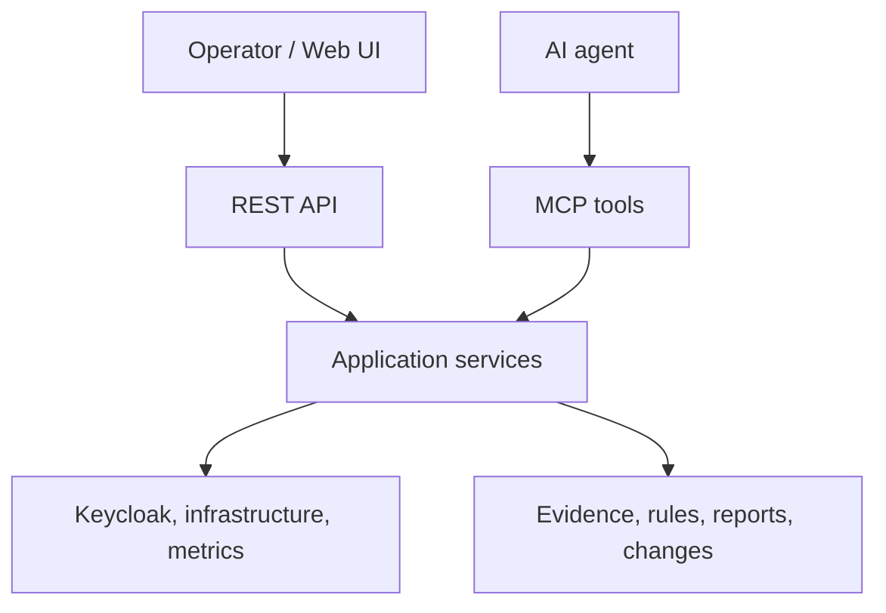

# Keycloak / RHBK Operations

Backend + Web UI for evidence-based **diagnostics**, **health**, **assessment**, **semantic metrics**, and controlled administration of [Keycloak](https://www.keycloak.org/) and [Red Hat build of Keycloak (RHBK)](https://docs.redhat.com/en/documentation/red_hat_build_of_keycloak) environments.

| | |
|---|---|
| Version | **0.8.1-SNAPSHOT** backend / **0.8.1-dev.0** UI *(experimental / evolving)* |
| Artifact | `io.github.keycloakmcp:keycloak-operations-mcp` |
| Web UI | `ui/` (React + TypeScript + Vite) |
| Runtime | Java **21**, Quarkus **3.39.4**, Node **24 LTS** recommended (UI; supported engines in `ui/package.json`) |
| License | [Apache License 2.0](LICENSE) |
| Repository | https://github.com/csfreitas/keycloak-operations |

**Upgrade boundary:** this development snapshot includes Flyway V11. Populated
installations with legacy/configuration ID collisions require governed adoption
before upgrade; that workflow is not yet delivered. Do not use an image-only
rollback or mixed-version writers. See [ownership and upgrade limits](docs/architecture/registry-ownership.md).

## Why it exists

Operators ask natural-language and console questions about realms, HA posture, misconfigurations, and runtime health across **many** environments. This project provides a **structured, auditable** MCP + REST backend — with redaction, target isolation, and deterministic assessments — and a Fleet Operations Console that consumes only those APIs.

## Current capabilities

- Multi-target Keycloak/RHBK **read-only** Admin tools (MCP)
- REST `/api/v1` for fleet, history, inventory, assessments, health, metrics
- Opt-in [restricted configuration reads](docs/configuration-reads.md): realm/client Boolean fields in `/configuration`, REST and MCP, bound to exact roles/resources/fields and approved client/channel. No default grants; legacy broad roles remain additive. Two-operator local OIDC/provider validation is recorded; production/RHBK/OpenShift acceptance remains pending
- OpenShift/Kubernetes infrastructure inventory with explicit connections, exact workload binding and scoped networking associations (real cluster acceptance still open)
- Deterministic assessment engine + health checks
- Consolidated on-demand operations report for humans and AI agents
- Semantic Prometheus / OpenShift Monitoring metrics (no raw PromQL from clients)
- PostgreSQL persistence (Flyway) for operational history — **not** a TSDB
- **Fleet Operations Console** (`ui/`) — fleet, overview, health, assessment, performance, infrastructure, history
- Controlled administration — typed client URL, security/flow, creation, and enable/disable changes with plan, review, approve, apply, verify, and audit
- OIDC/PKCE UI and target-level grants; [local browser identity validation](docs/development/d1-browser-negatives-2026-09-19.md) covers bounded positive/negative cases and records revocation limits. Existing-target Installation discovery/review/confirmation has mandatory audit; full H1/D1 and production IdP acceptance remain open
- Optional [reference profile 0.2.1](dev/reference-agent/README.md) with fixed scoped report collection, bounded report-bound finding/evidence details, exact-fact/reference checks and a no-AI fallback. This is a local contract prototype; no model/provider is enabled and full model evaluation/acceptance remains open

Status detail: [`docs/project-state.md`](docs/project-state.md). New connection/target registration, host/container collectors, retained-evidence replay, full IAM analytics and SPI execution are planned, not delivered.

## Architecture (summary)


```mermaid
flowchart TB
  Human[Operator / Web UI] --> REST[REST API]
  Agent[AI agent] --> MCP[MCP tools]
  REST --> Services[Application services]
  MCP --> Services
  Services --> Providers[Keycloak, infrastructure, metrics]
  Services --> Evidence[Evidence, rules, reports, changes]
```

The browser never talks to Keycloak Admin, Kubernetes/OpenShift, Prometheus, or PostgreSQL directly.

Planned installation direction: a separate [Operations Operator](docs/architecture/operator-managed-platform.md)
will manage this platform on OpenShift while assessments remain portable across
approved local/external environments. [OP1](docs/milestones/op1-operator-installation.md)
is design-only: no controller, CRD or installable Operator is delivered yet.

See [`docs/architecture/`](docs/architecture/) and [`docs/ui-architecture.md`](docs/ui-architecture.md).

## Quick start

```bash
# Local Keycloak + PostgreSQL (+ Prometheus as documented)
docker compose -f dev/compose.yaml up -d

# Backend
JENV_VERSION=21 jenv exec mvn quarkus:dev
# MCP Streamable HTTP typically at http://localhost:8081/mcp
# REST at http://localhost:8081/api/v1

# Web UI (separate terminal)
cd ui && npm ci && npm run dev
# http://localhost:3000
```

Build / test:

```bash
JENV_VERSION=21 jenv exec mvn clean verify
cd ui && npm ci && npm run test:run && npm run build
```

More: [`docs/development.md`](docs/development.md), [`ui/README.md`](ui/README.md).

If not using jenv, select Java 21 with your environment manager. Local Compose is a named project with reusable data volumes; stop it without deleting retained data, and never globally prune. Default verification starts disposable PostgreSQL test resources even though Keycloak integrations are opt-in; see [integration guide](integration-tests/README.md).

Packaged applications fail closed by default. Explicit loopback-only lab: `QUARKUS_PROFILE=local-lab`; authenticated REST/MCP/SSE: `oidc` profile with audience validation and exact role/target permissions. See [identity model](docs/identity-model.md). A read-only demo does not validate production write safety.

## Documentation

| Path | Purpose |
|------|---------|
| [docs/README.md](docs/README.md) | Documentation map: current guides, designs and historical evidence |
| [docs/project-state.md](docs/project-state.md) | HEAD and working-tree checkpoint for humans & agents |
| [docs/requirements/](docs/requirements/) | **What** (normative requirements) |
| [docs/architecture/](docs/architecture/) | **How** |
| [docs/adr/](docs/adr/) | **Why** (decisions) |
| [docs/milestones/](docs/milestones/) | **When** (delivery slices) |
| [docs/roadmap.md](docs/roadmap.md) | Complete roadmap with executable milestone specifications |
| [AGENTS.md](AGENTS.md) | AI coding bootstrap |
| [CONTRIBUTING.md](CONTRIBUTING.md) | Contribution guide |
| [ui/README.md](ui/README.md) | Fleet Console frontend |

## Roadmap

Current priority: **trust hardening → local read-only workflow → verified RHBK/OpenShift → trustworthy reports → January 2027 presentation**. Business/IAM indicators, anomalies and isolated custom-SPI assurance have explicit subsequent gates. Broad administration is deferred. Dates, acceptance, dependencies and implementation status: [complete roadmap](docs/roadmap.md), [demo readiness](docs/milestones/2027-01-demo-readiness.md).

## Status

This repository is under active development (`*-SNAPSHOT`). APIs and tools may change. Compatibility claims distinguish **tested** vs **design-compatible** — see [`docs/compatibility.md`](docs/compatibility.md).

## Contributing

See [`CONTRIBUTING.md`](CONTRIBUTING.md). AI-assisted contributions are welcome; contributors remain responsible for correctness, tests, and review.
