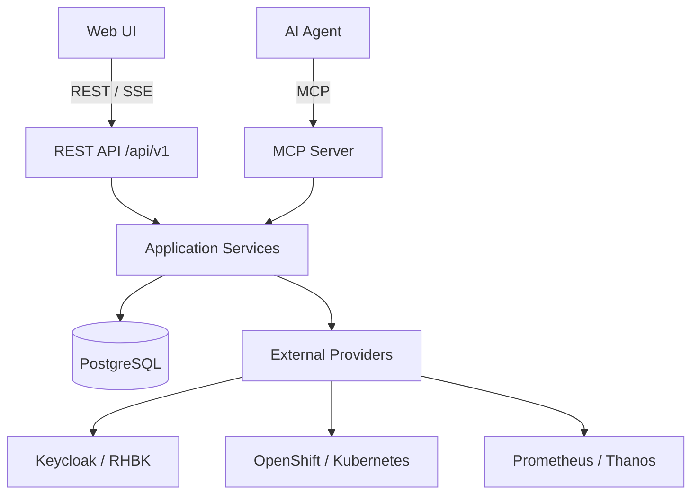
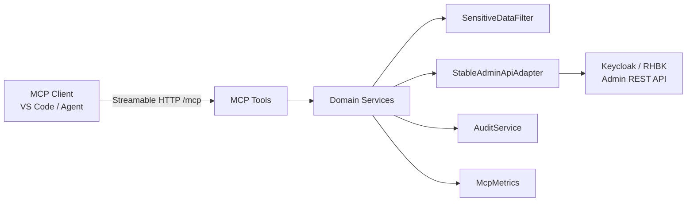
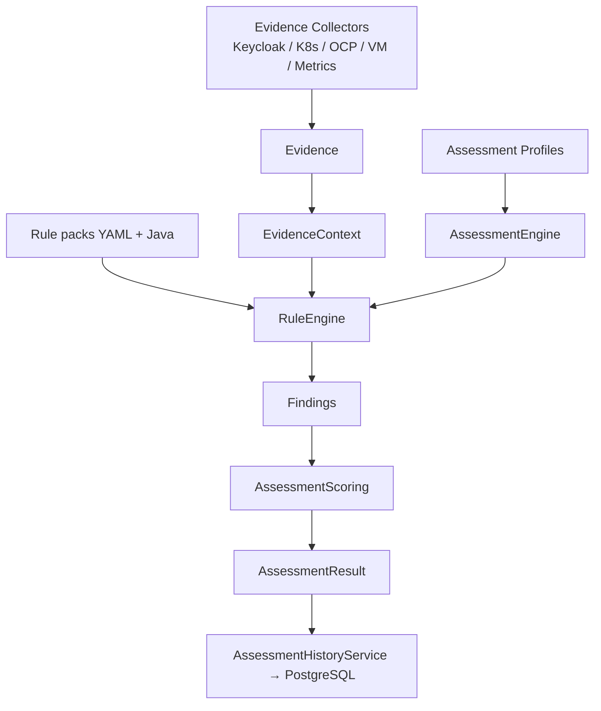
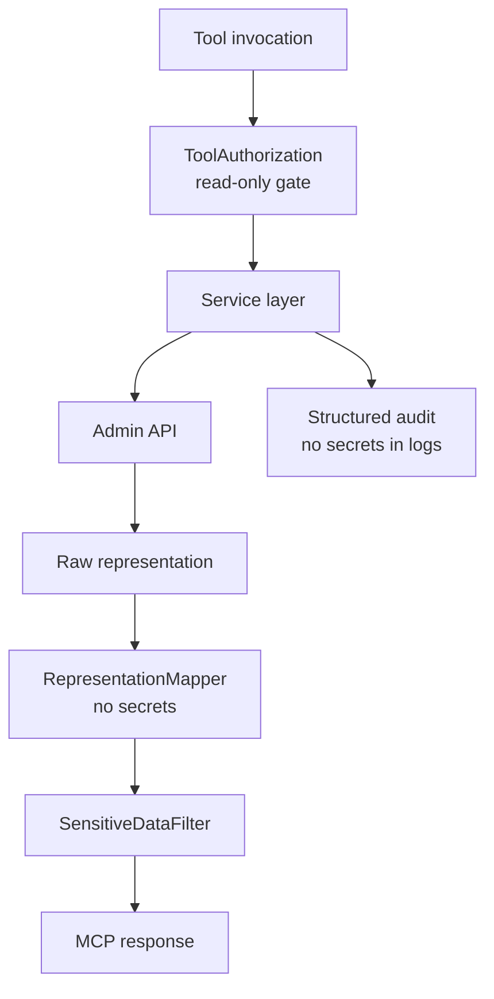

# Architecture

`keycloak-operations-mcp` is evolving into a **Keycloak / RHBK Operations Platform**
backend: MCP + REST share the same application services, with PostgreSQL for
operational history (not time-series metrics).

## Platform overview



REST Controllers and MCP Tools must never reimplement Keycloak access logic —
both call the same services (for example `ClientService`, `AssessmentHistoryService`).

## High-level components

| Layer | Responsibility |
|-------|----------------|
| MCP Tools | Thin Quarkiverse `@Tool` facade (`keycloak_*`) |
| REST API | Versioned `/api/v1` for Fleet / overview / history |
| Services | Domain orchestration, audit, metrics, persistence |
| Persistence | JPA entities + Flyway (targets, assessments, health, audit, snapshots) |
| Adapters | Keycloak Admin Client (stable API), future K8s/OCP/VM |
| Observability | `MetricsProvider` / factory (semantic queries; no raw PromQL tools); performance evidence |
| Security | Sensitive data redaction, read-only enforcement, target authz |

## Administration



Design rules:

- Tools never call the Admin Client directly.
- `AdminApiV2Adapter` exists only as a documented non-primary path and returns
  `UNSUPPORTED_CAPABILITY` in 0.1.0.
- Client secrets are never mapped into `ClientDetails`.
- Credentials are referenced via `credentialRef` only — never stored in PostgreSQL plaintext.

## Assessment



Assessment consumes **normalized evidence keys** (for example `deployment.replicas`),
not raw Kubernetes objects. Health checks and assessments are distinct concepts:
health answers “is it up?”; assessment answers “is it production-ready?”.

## Security



Two identities: operators authenticate to the platform (Identity A / OIDC planned);
the platform authenticates to Targets via `credentialRef` (Identity B). See
[identity-model.md](identity-model.md).

## Runtime modes

- **Streamable HTTP** (default): Quarkus on port `8081`, MCP endpoint `/mcp`,
  management port `9001` for health/metrics/OpenAPI (local compose reserves `9000` for Keycloak).
- **STDIO**: Maven profile `stdio` for local desktop MCP hosts.
- **REST**: `/api/v1/*` on the application port for the future Web UI.

## Package layout (simplified)

```
io.github.keycloakmcp
├── api/v1/         # REST controllers
├── mcp/            # Tool entry points
├── service/        # Business + platform services
├── persistence/    # JPA entities, repositories, mappers
├── adapter/        # Keycloak / future platform adapters
├── security/       # Redaction + authorization
├── discovery/      # Environment detection
├── collector/      # Evidence collectors
├── assessment/     # Engine, profiles, scoring
├── domain/         # Immutable DTOs + errors
├── audit/          # Structured audit (+ DB persister)
├── observability/  # Micrometer + MetricsProvider
├── target/         # Multi-target registry
└── config/         # ConfigMapping interfaces
```
