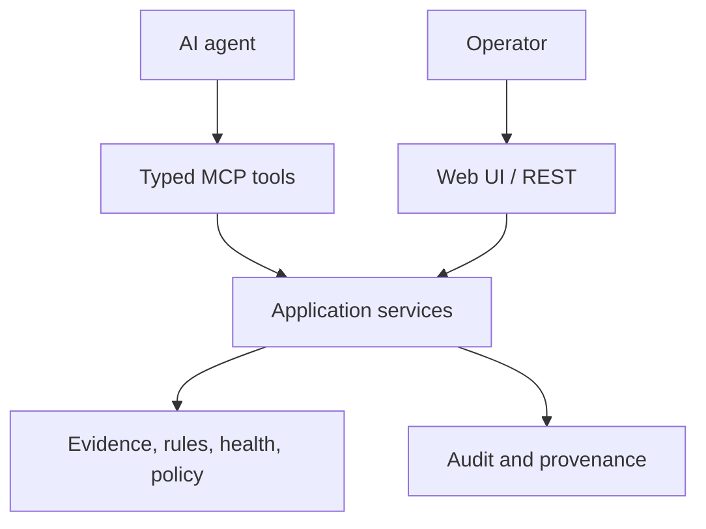

# AI-assisted operations architecture

## Position

The project is an AI-assisted Keycloak/RHBK operations control plane, not an LLM wrapper around arbitrary administrative APIs. MCP is the native agent interface; REST and the Web UI remain equivalent human-facing interfaces over the same application services.

## AI responsibilities

AI agents may:

- discover registered targets and available semantic capabilities;
- select and sequence health, assessment, inventory, metrics, reporting, and change-planning tools;
- correlate deterministic results across sections and targets;
- explain findings in operator language;
- propose a semantic change plan for backend evaluation;
- assist investigation while preserving evidence identifiers and uncertainty.

AI agents do not decide:

- health, PASS/FAIL, severity, score, evidence completeness, or confidence;
- authorization, risk, policy, approval requirement, or approval validity;
- stale-plan conflicts, apply success, or verification outcome;
- which unregistered endpoint, credential, Admin REST path, or PromQL query to execute.

## Context design

AI-facing responses should be compact and layered:

1. stable identifiers and target metadata;
2. explicit status and completeness;
3. bounded summaries and actionable findings;
4. provenance identifiers for persisted health, assessment, snapshot, change, and report objects;
5. opt-in detail retrieval through semantic tools.

This avoids injecting entire Kubernetes objects, Keycloak representations, or time-series payloads into a model context. Structured values remain the source of truth; rendered Markdown is a convenience view.

## Future extension points

| Extension | Guardrail |
|---|---|
| Explanation service | Output labeled AI-generated and linked to deterministic report/evidence IDs |
| Fleet incident copilot | Read-only correlation first; no automatic remediation |
| Retrieval over project/runbooks | Versioned sources, provenance, bounded excerpts |
| Change-plan assistant | Semantic typed requests only; backend owns risk/policy |
| Scheduled summaries | Re-run deterministic collection before explanation; record trigger and timestamps |
| Feedback/evaluation | Test hallucination, unsafe tool choice, cross-target leakage, and unsupported claims |

Core operation must not depend on an external model provider. This keeps local/offline operation possible and prevents model availability from becoming a control-plane dependency.
