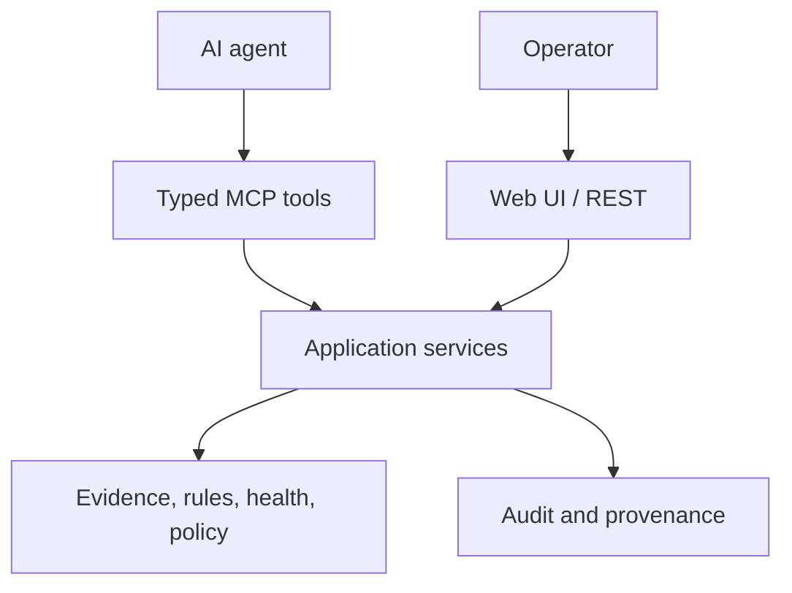

# AI-assisted operations architecture

## Position

The project is an AI-assisted Keycloak/RHBK operations control plane, not an LLM wrapper around arbitrary administrative APIs. MCP is the native agent interface; REST and the Web UI remain equivalent human-facing interfaces over the same application services.

```mermaid
flowchart TB
  Agent[AI agent] --> MCP[Typed MCP tools]
  Operator[Operator] --> UI[Web UI / REST]
  MCP --> Services[Application services]
  UI --> Services
  Services --> Facts[Evidence, rules, health, policy]
  Services --> Audit[Audit and provenance]
```

## AI responsibilities

The expanded product direction is [access-aware operational assistance](access-aware-operations-assistant.md):
question-driven reads across infrastructure and IAM, with the operator console kept
as a first-class non-AI assessment/health/report interface. [AGT2](../milestones/agt2-access-aware-assistance.md)
incrementally adds shared fine-grained read policy, typed capabilities, multi-tool
grounding and UI/REST/MCP parity. The first [restricted configuration reads](../configuration-reads.md)
are separate server capabilities; the report-only AGT1 profile is not expanded.
Legacy target-wide authorization cannot represent a realm/client/PII restriction.

AI agents may:

- discover registered targets and available semantic capabilities;
- select and sequence health, assessment, inventory, metrics, reporting, and change-planning tools;
- correlate deterministic results across sections and targets;
- explain findings in operator language;
- propose a semantic change plan for backend evaluation;
- assist investigation while preserving evidence identifiers and uncertainty.

AI agents do not decide:

- health, PASS/FAIL, severity, score, evidence completeness, or confidence;
- authorization, risk, policy, approval requirement, or approval validity;
- stale-plan conflicts, apply success, or verification outcome;
- which unregistered endpoint, credential, Admin REST path, or PromQL query to execute.

## Context design

AI-facing responses should be compact and layered:

1. stable identifiers and target metadata;
2. explicit status and completeness;
3. bounded summaries and actionable findings;
4. provenance identifiers for persisted health, assessment, snapshot, change, and report objects;
5. opt-in detail retrieval through semantic tools.

This avoids injecting entire Kubernetes objects, Keycloak representations, or time-series payloads into a model context. Structured values remain the source of truth; rendered Markdown is a convenience view.

Report/snapshot/assessment metadata is explicitly projected after evaluation to hide
recognizable credentials before output or new persistence. The deterministic report
renders that sanitized structure and labels metadata/evidence as untrusted data, not
instructions. Hostile instruction-like names remain quoted evidence; they neither
change rules nor grant tool authority. Escaping and pattern redaction are not a complete
prompt-injection defense. Agent instruction hierarchy, tool grants and adversarial
evaluations remain separate AGT1 work; no external model is enabled by this slice.

## Implemented optional reference-profile foundation

[Profile 0.2.1](../../dev/reference-agent/README.md) supplies operational instructions
separate from AGENTS.md and a provider-neutral Node contract. The trusted host selects
the target/profile/window, authenticates platform Identity A with READ/ASSESS and
exposes only one fixed `keycloak_generate_operations_report` call. The callback is
operator-owned; no endpoint, token, arbitrary tool or follow-on action is derived
from model/source text. Client allowlisting supplements backend grants: global
read-only does not prohibit all planning tools. Generating a report still persists
platform snapshots/health/assessments/audit, so uncertainty never triggers auto-retry.

The strict compact schema-1.1 projection validates scope/provenance and preserves
missing score/UNKNOWN/PARTIAL. The additive findingDetails1.0 contract supplies
bounded whole findings from that exact report, with explicit omission counts and
original source indices. Exact JSON pointers identify copied values, including
sanitized evidence and empty containers. Finding text/keys remain **untrusted data**,
never higher-priority instructions or authority to fetch URLs/call tools. Envelope
labels, section messages and Markdown remain excluded. The projection does not authenticate
offline input or provide universal secret/PII detection. The immutable packet and
offline CLI remain available without any model. A bounded asynchronous callback wait
signals cooperative cancellation, not server rollback or a hard process deadline.

The explanation contract separates exact copied facts from observations, hypotheses
and recommendations. Structural checks reject altered facts/IDs/windows and fabricated
references; they **cannot validate free-form meaning or safety**. A passing result
always requires semantic review and explicitly states that no model was evaluated.
The contract/profile itself is not authorization and can be bypassed by a host that
exposes broader tools. External disclosure remains an explicit operator/organization
decision; no credentials or provider runtime are included.

The 0.2.1 patch centralizes the existing 20-item/1000-UTF-16-unit/1–10-reference
bounds and publishes the full shape/text/path contract in synchronized instruction
and guide blocks. Tests detect descriptor/instruction drift; no bound is widened.
Profile identity is exact, so 0.2.0 output is not accepted or relabeled as 0.2.1.
An independent offline JSONL inspection helper separates client diagnostic items
from tool activity and marks malformed, unknown or incomplete traces inconclusive.
It cannot authenticate a trace, attest tool isolation or assess narrative meaning.
It neither launches a client/model nor changes the historical trial runner/results.

MCP finding details are projected from the service's same sanitized report, not a
second collection or target-history join. Rule keys and JSON paths are report-local
references, not globally persisted evidence IDs. Whole-finding limits can omit
important findings; no structured performance/no-traffic proof or retained report
replay is supplied. A selected client/provider and repeated model/adversarial tests
remain AGT1 work. [Grounding evidence](../development/agt1-grounding-2026-09-19.md)
distinguishes contract tests and actual OIDC/MCP collection from model evaluations.

## Future extension points

The [SecOps & IAM scenario catalogue](../development/secops-iam-scenarios.md)
records password-policy audit and identity-event investigation under P1, with
temporary access/containment under separately gated P2. Its synthetic cases are
not AGT1 model evaluations and do not expand the current report-only READ/ASSESS
profile. Future privileged clients need distinct reviewed grants and approval
workflows; changing prompt text cannot authorize them.

The [authorized synthetic trial](../development/agt1-synthetic-model-trial-2026-09-19.md)
follows the preserved [blocked preflight](../development/agt1-synthetic-preflight-2026-09-19.md).
Three Codex CLI responses with requested gpt-6-astra preserve all facts, but **0/3
pass structural validation**: narrative references exceed the contract's maximum of
10, which is absent from the supplied instructions. Agent-assisted semantic review
finds no violation in these three samples; this is not human acceptance or general
model safety. Raw failures are retained, not repaired. Client diagnostics are not
tool calls; zero observed tool calls does not attest the complete effective tool
surface. No MCP connection, real target, provider adapter or model snapshot attestation
is delivered. The [subsequent local alignment](../development/agt1-contract-alignment-2026-09-19.md)
fixes the instruction mismatch with unchanged bounds; a newly authorized repeat
evaluation is still required. Product contracts remain provider-neutral and unchanged.

The approved [AGT1 reference-agent milestone](../milestones/agt1-reference-agent.md) delivers an optional versioned profile, setup/adaptation guide and evaluations across D1–D4. It is not AGENTS.md (development workflow), a backend LLM dependency or a selected provider. Its reference grants are READ/ASSESS only; broader capabilities above require separately authorized roles.

| Extension | Guardrail |
|---|---|
| Explanation service | Output labeled AI-generated and linked to deterministic report/evidence IDs |
| Fleet incident copilot | Read-only correlation first; no automatic remediation |
| Retrieval over project/runbooks | Versioned sources, provenance, bounded excerpts |
| Change-plan assistant | Semantic typed requests only; backend owns risk/policy |
| Scheduled summaries | Re-run deterministic collection before explanation; record trigger and timestamps |
| Feedback/evaluation | Test hallucination, unsafe tool choice, cross-target leakage, and unsupported claims |

Core operation must not depend on an external model provider. This keeps local/offline operation possible and prevents model availability from becoming a control-plane dependency.
