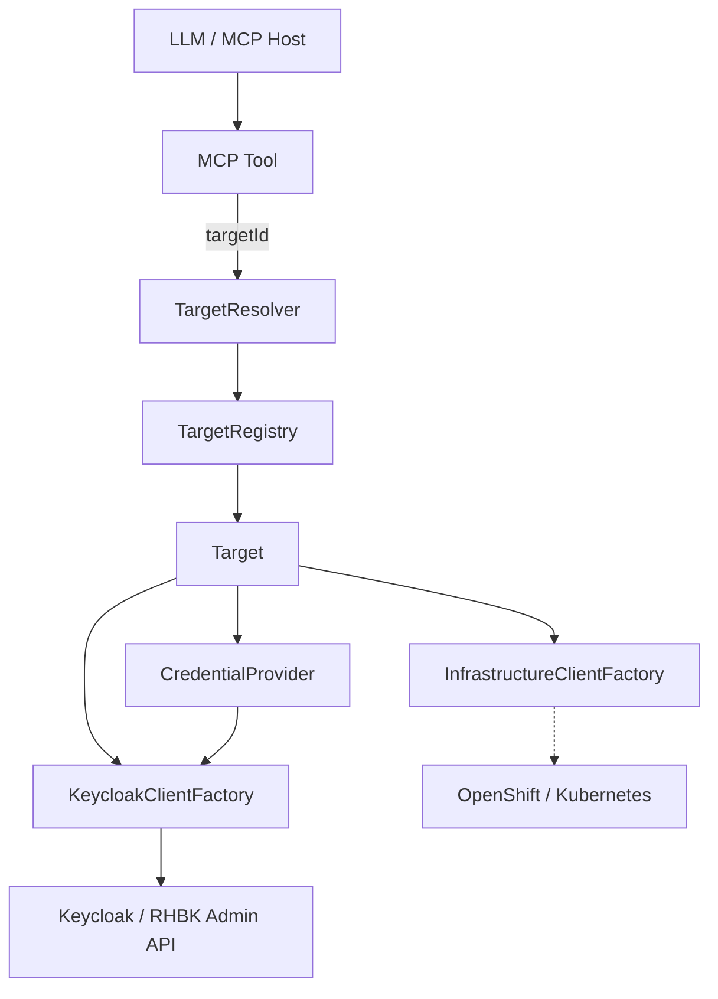

# Multi-target architecture

A single **Keycloak Operations MCP** process can administer and assess multiple
independent Keycloak / RHBK environments. Each environment is a registered
**Target** identified only by a logical `targetId`.

> **multi-target ≠ multi-tenant**  
> Multi-target means one MCP knows many environments.  
> Multi-tenancy would isolate which users see which targets (future).

## Security model (SSRF)

MCP tools **never** accept arbitrary URLs (Keycloak, OpenShift, Prometheus, SSH).

```text
targetId  →  TargetRegistry  →  Target  →  known endpoints + credentialRef
```

This mitigates:

- SSRF against internal networks
- credential use against the wrong host
- accidental lateral movement

## Components



| Component | Role |
|-----------|------|
| `Target` | Registered environment (id, type, env, keycloak config, optional infra) |
| `TargetRegistry` | Lookup of configured targets (`ConfigurationTargetRegistry`) |
| `TargetResolver` | Validates id; rejects unknown / disabled |
| `CredentialProvider` | Resolves secrets from `credential-ref` (never stored on Target) |
| `KeycloakClientFactory` | Per-target Admin client with fingerprint cache |
| `InfrastructureClientFactory` | Future OpenShift/K8s/VM clients |
| `TargetAuthorizationService` | Per-target READ/ASSESS/WRITE/ADMIN (WRITE denied in read-only) |

## Configuration

Secrets live under `mcp.credentials.*`. Targets only reference them:

```properties
mcp.credentials.lab-a.client-secret=${LAB_KEYCLOAK_A_CLIENT_SECRET}
mcp.targets.lab-keycloak-a.display-name=Lab Keycloak A
mcp.targets.lab-keycloak-a.type=KEYCLOAK
mcp.targets.lab-keycloak-a.environment=DEV
mcp.targets.lab-keycloak-a.keycloak.url=http://localhost:8080
mcp.targets.lab-keycloak-a.keycloak.client-id=keycloak-mcp
mcp.targets.lab-keycloak-a.keycloak.credential-ref=lab-a
```

YAML-style layout is equivalent via Quarkus/SmallRye nested properties.

## Client caching

`KeycloakClientFactory` keeps one `Keycloak` client per target id, fingerprinted by
`(url, authRealm, clientId, sha256(secret))`. On fingerprint change the old client
is closed. Secrets are never logged.

## Tools

All admin tools require `targetId`. Discovery tools:

- `keycloak_list_targets`
- `keycloak_get_target`
- `keycloak_find_targets` (optional product / environment filters)

Responses never include URLs, `credentialRef`, or secrets.

There is **no implicit default target** (including production).

## Assessment

Evidence and Findings always carry `targetId`. The assessment engine runs in the
context of one Target so DEV/HML/PRD data cannot mix silently.

Future: `keycloak_compare_targets` for pairwise comparison.

## Local multi-target lab

```bash
# Target A only (default)
podman compose -f dev/compose.yaml up -d
./scripts/setup-dev.sh

# Target A + B
podman compose -f dev/compose.yaml --profile multi-target up -d
KEYCLOAK_URL=http://localhost:8080 ./scripts/setup-dev.sh
KEYCLOAK_URL=http://localhost:8180 KEYCLOAK_HEALTH_URL=http://localhost:9002/health/ready ./scripts/setup-dev.sh
```

Targets: `lab-keycloak-a` (realm `mcp-demo`), `lab-keycloak-b` (realm `company-b`).

## Centralized vs distributed

**Recommended (current):** one MCP with network reach to all targets.

**Future:** edge collectors in air-gapped sites reporting to a central MCP —
the Target abstraction stays the same; only how evidence is collected changes.

Use a **separate MCP instance** when trust domains, regulation, or network
isolation forbid a shared control plane.
