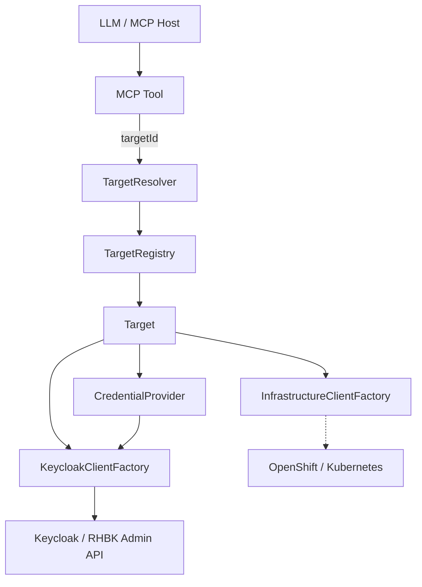

# Multi-target architecture

A single **Keycloak Operations MCP** process can administer and assess multiple
independent Keycloak / RHBK environments. Each environment is a registered
**Target** identified only by a logical `targetId`.

> **multi-target ≠ multi-tenant**  
> Multi-target means one MCP knows many environments.  
> Target-level caller grants are implemented; full tenant, realm/resource and operational isolation remain broader future governance work.

## Security model (SSRF)

MCP tools **never** accept arbitrary URLs (Keycloak, OpenShift, Prometheus, SSH).

```text
targetId  →  TargetRegistry  →  Target  →  known endpoints + credentialRef
```

This mitigates:

- SSRF against internal networks
- credential use against the wrong host
- accidental lateral movement

## Components


```mermaid
flowchart TD
  LLM[LLM / MCP Host] --> Tool[MCP Tool]
  Tool -->|targetId| Resolver[TargetResolver]
  Resolver --> Registry[TargetRegistry]
  Registry --> Target[Target]
  Target --> Creds[CredentialProvider]
  Target --> Factory[KeycloakClientFactory]
  Creds --> Factory
  Factory --> KC[Keycloak / RHBK Admin API]
  Target --> InfraFactory[InfrastructureClientFactory]
  InfraFactory -.-> OCP[OpenShift / Kubernetes]
```

| Component | Role |
|-----------|------|
| `Target` | Registered environment (id, type, env, keycloak config, optional infra) |
| `TargetRegistry` | Configuration, database or composite target lookup |
| `TargetResolver` | Validates id; rejects unknown / disabled |
| `CredentialProvider` | Resolves secrets from `credential-ref` (never stored on Target) |
| `KeycloakClientFactory` | Per-target Admin client with fingerprint cache |
| `InfrastructureClientFactory` | Explicit OpenShift/K8s clients; host/container collectors not implemented |
| `TargetAuthorizationService` | Exact role/target grants; READ/DISCOVER/BIND/ASSESS/PLAN/APPROVE/WRITE/ADMIN, with global read-only gates |

Database-backed registry definitions now have [explicit ownership and row revisions](registry-ownership.md).
Configuration seed only changes CONFIGURATION-owned rows and audits effective changes
atomically; old rows are LEGACY_UNCLASSIFIED until a future reviewed adoption process.
`database` and `composite` use the database after successful bootstrap, never a
configuration fallback after failure or emptiness. A disabled database row is not
replaced by a configured namesake. Explicit configuration mode remains separate.

## Configuration

Secrets live under `mcp.credentials.*`. Targets only reference them:

```properties
mcp.credentials.lab-a.client-secret=${LAB_KEYCLOAK_A_CLIENT_SECRET}
mcp.targets.lab-keycloak-a.display-name=Lab Keycloak A
mcp.targets.lab-keycloak-a.type=KEYCLOAK
mcp.targets.lab-keycloak-a.environment=DEV
mcp.targets.lab-keycloak-a.keycloak.url=http://localhost:8080
mcp.targets.lab-keycloak-a.keycloak.client-id=keycloak-mcp
mcp.targets.lab-keycloak-a.keycloak.credential-ref=lab-a
```

YAML-style layout is equivalent via Quarkus/SmallRye nested properties.

## Client caching

`KeycloakClientFactory` keeps separate ordinary and scoped-collection caches, each
with one `Keycloak` client per target id, fingerprinted by
`(url, authRealm, clientId, sha256(secret))`. On fingerprint change that cache's old
client is closed; both caches close on shutdown. Scoped reads use request-local
remaining-budget timeouts, without mutating the ordinary/controlled-write client.
The collection transport requires an active matching target scope. Nested
same-target collection inherits the shorter remaining deadline; a different
target cannot borrow that scope. The default collection budget is 30 seconds,
with a 120-second ceiling. Per-request connect, pool-acquisition and socket
timeouts are capped at five seconds or the remaining budget. Captured body
checkpoints stop subsequent work without background collection workers; these
cooperative limits do not guarantee a wall-clock deadline for blocked I/O,
DNS/TLS, persistence or rendering.

Only the scoped client uses the strict Admin response boundary: 1 MiB transport
and decoded Admin bodies, 64 KiB decoded token bodies, bounded gzip decoding and
500-item realm/client lists. Duplicate fields/identities, trailing JSON and
malformed supported representations fail closed rather than producing partial
lists or observed zero. The schema checks are selective, not complete Admin API
validation or proof of full server-side inventory coverage.

Scoped diagnostic admission checks selected RESTEasy/Apache categories before
credential resolution and again during client creation, requests and body reads.
Enabled DEBUG/TRACE diagnostics reject collection; the policy never changes
operator logging levels. Native Apache authentication challenges and cookies are
disabled for these requests, while OAuth client credentials/bearer authentication
remain unchanged. Scoped adapter errors omit raw identifiers/details/causes;
ordinary clients keep their previous transport and error behavior. Logging
reconfiguration during blocked I/O and pool-maintenance/cleanup diagnostics are
not atomically protected. See the [security boundary](security.md#scoped-admin-response-and-diagnostic-boundary)
and [Admin-boundary evidence](../development/h1-admin-boundaries-2026-09-18.md)
for the implemented limits and validation scope.

## Tools

All admin tools require `targetId`. Discovery tools:

- `keycloak_list_targets`
- `keycloak_get_target`
- `keycloak_find_targets` (optional product / environment filters)

Responses never include URLs, `credentialRef`, or secrets.

There is **no implicit default target** (including production).

Infrastructure connection, logical target and installation identity are distinct. V9–V10 supports exact cluster-resource bindings and existing-target confirmation, not new target/connection CRUD. See [portable discovery](portable-environment-discovery.md) and [identity model](../identity-model.md).

## Assessment

Registered target IDs remain canonical in filtered read views; free-form display
names, tags and diagnostic metadata are lossy copies, never registry configuration.
REST environment observation explicitly checks READ before discovery, as inventory
does through its service. Authentication alone is not target authorization. The local
identity runner checks own/foreign/unmapped environment access; see the
[read-boundary ledger](../development/h1-read-metadata-2026-09-19.md).

Evidence and Findings always carry `targetId`. The assessment engine runs in the
context of one Target so DEV/HML/PRD data cannot mix silently.

Future: `keycloak_compare_targets` for pairwise comparison.

## Local multi-target lab

```bash
# Target A only (default)
podman compose -f dev/compose.yaml up -d
./scripts/setup-dev.sh

# Target A + B
podman compose -f dev/compose.yaml --profile multi-target up -d
KEYCLOAK_URL=http://localhost:8080 ./scripts/setup-dev.sh
KEYCLOAK_URL=http://localhost:8180 KEYCLOAK_HEALTH_URL=http://localhost:9002/health/ready ./scripts/setup-dev.sh
```

Targets: `lab-keycloak-a` (realm `mcp-demo`), `lab-keycloak-b` (realm `company-b`).

## Centralized vs distributed

**Recommended:** an Operations hub with explicit approved connections to reachable
targets. [ADR 0012](../adr/0012-operator-managed-portable-platform.md) adds a separate
installation Operator as a planned OpenShift delivery path, not an operational
dependency or automatic permission to read the hosting cluster.

**Future:** optional site collectors for restricted networks or host/container
evidence, with authenticated outbound communication when connectivity exists.
Truly air-gapped sites require authorized offline import, not a live reporting
connection. Neither collector transport is implemented. See the
[deployment boundaries](operator-managed-platform.md).

Use a **separate Operations instance** when trust domains, regulation, or network
isolation forbid a shared control plane. Multi-target is not complete multi-tenancy.
Many independent targets can span clusters; a single multi-site environment needs
a future 1:N installation model, not the current single infrastructure binding.
