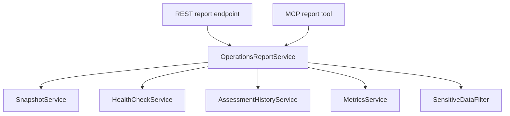

# Operations reporting architecture

## Purpose

An operations report gives a human or AI agent sanitized observations of a registered Keycloak/RHBK target over a collection window. It composes existing services; it is not an atomic snapshot, second assessment engine or source of inferred missing facts.

Schema 1.1 adds explicit start/end, `INDEPENDENT_SECTION_COLLECTIONS` mode, bundled-rule-catalog SHA-256 and `retainedEvidenceReplayAvailable=false`. The hash identifies packaged rule resources, not runtime overrides or retained evidence. Snapshot/health/assessment IDs remain references, not proof of complete replay. Unavailable assessment scores are labeled INCONCLUSIVE in Markdown and nullable in the MCP envelope; the structured legacy numeric field remains with a computed `scoreAvailable` flag. See [trustworthy reporting](trustworthy-reporting.md) for the complete target design and [IAM/business observability](iam-business-observability.md) for planned indicators.

## Contract

`OperationsReportService.generate(targetId, profile, metricsWindow, triggerType)` resolves and authorizes the target once, then executes the existing target-aware collectors. REST returns the full sanitized structured report plus Markdown. MCP returns a compact envelope plus deterministic Markdown containing curated platform summaries rather than pod lists or raw provider objects, keeping agent context bounded.

Report completeness (`COMPLETE`, `PARTIAL`, `FAILED`) describes collection success only. It is separate from:

- health (`HEALTHY`, `WARNING`, `CRITICAL`, `UNKNOWN`);
- assessment execution (`COMPLETE`, `PARTIAL`, `FAILED`);
- assessment score and findings;
- metrics provider availability.

Each section has an explicit `COMPLETE`, `PARTIAL`, `FAILED`, or `SKIPPED` state. A missing metrics provider is `SKIPPED`; an incomplete assessment is `PARTIAL`; no missing signal becomes zero or PASS.

## Platform coverage

| Runtime | Current evidence | Status |
|---|---|---|
| OpenShift | Distribution/version, nodes/zones, Keycloak workload, pods, topology, scheduling, HPA, PDB, resources, probes, Services and Routes | IMPLEMENTED |
| Kubernetes | Version/platform, nodes/zones, workload, pods, topology, scheduling, HPA, PDB, resources, probes, Services and Ingress | IMPLEMENTED |
| VM | Runtime classification only; no host/process/config collector | NOT IMPLEMENTED |
| Docker | No explicit runtime type or collector | NOT IMPLEMENTED |

Adding VM or Docker requires a provider-specific collector, a stable sanitized evidence schema, credential isolation, bounds, tests, and compatibility documentation. Runtime guesses are not report evidence.

## Security and data handling

- All operations require a registered `targetId` and `ASSESS` permission.
- Provider coordinates and credentials are resolved by the backend.
- Snapshots and reports include sanitized configuration metadata, never Kubernetes Secret contents or unrestricted environment variables. Endpoint URLs and credential references are omitted from the report representation.
- Actionable findings are copied from deterministic assessment output.
- Provider exceptions are represented by safe section status, not raw internal messages.
- The human-readable report is generated by backend code and filtered before return.

The first implementation is generated on demand and is not independently persisted. It references persisted snapshots, health checks, and assessments. Scheduling, report history/export, fleet aggregation, and notification delivery belong to later milestones.
