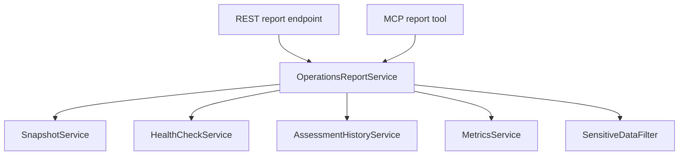

# Operations reporting architecture

## Purpose

An operations report gives a human or AI agent sanitized observations of a registered Keycloak/RHBK target over a collection window. It composes existing services; it is not an atomic snapshot, second assessment engine or source of inferred missing facts.

Schema 1.1 adds explicit start/end, `INDEPENDENT_SECTION_COLLECTIONS` mode, bundled-rule-catalog SHA-256 and `retainedEvidenceReplayAvailable=false`. The hash identifies packaged rule resources, not runtime overrides or retained evidence. Snapshot/health/assessment IDs remain references, not proof of complete replay. Unavailable assessment scores are labeled INCONCLUSIVE in Markdown and nullable in the MCP envelope; the structured legacy numeric field remains with a computed `scoreAvailable` flag. See [trustworthy reporting](trustworthy-reporting.md) for the complete target design and [IAM/business observability](iam-business-observability.md) for planned indicators.

```mermaid
flowchart TB
  REST[REST report endpoint] --> Report[OperationsReportService]
  MCP[MCP report tool] --> Report
  Report --> Snapshot[SnapshotService]
  Report --> Health[HealthCheckService]
  Report --> Assessment[AssessmentHistoryService]
  Report --> Metrics[MetricsService]
  Report --> Filter[SensitiveDataFilter]
```

## Contract

`OperationsReportService.generate(targetId, profile, metricsWindow, triggerType)` resolves and authorizes the target once, then executes the existing target-aware collectors. REST returns the full sanitized structured report plus Markdown. MCP returns a compact envelope plus deterministic Markdown containing curated platform summaries rather than pod lists or raw provider objects, keeping agent context bounded.

Report completeness (`COMPLETE`, `PARTIAL`, `FAILED`) describes collection success only. It is separate from:

- health (`HEALTHY`, `WARNING`, `CRITICAL`, `UNKNOWN`);
- assessment execution (`COMPLETE`, `PARTIAL`, `FAILED`);
- assessment score and findings;
- metrics provider availability.

Each section has an explicit `COMPLETE`, `PARTIAL`, `FAILED`, or `SKIPPED` state. A missing metrics provider is `SKIPPED`; an incomplete assessment is `PARTIAL`; no missing signal becomes zero or PASS.

### Report-bound MCP finding details

The additive `findingDetails` extension has independent version **1.0**; canonical
report schema **1.1** and REST are unchanged. `AssessmentTools` projects only the
already-sanitized `OperationsReport` returned by the shared service. No history query,
second assessment, Markdown parsing or target-level finding join is performed.
The extension repeats `reportId`, `targetId` and `assessmentId` and carries:

- `availability`: AVAILABLE means a finding list exists, **not** complete coverage;
  UNAVAILABLE has null total/omitted counts and no items. An observed empty list has
  total/returned/omitted counts zero and remains distinct from unavailable assessment.
- `totalFindings`, `returnedFindings`, `omittedFindings`: total equals the report's
  actionable finding count; omitted is total minus returned, not a favorable zero.
- `items`: original `sourceIndex` plus the whole sanitized `ReportFinding`. The index
  locates `/assessment/findings/{sourceIndex}` in that report, while citations in the
  MCP response use `/findingDetails/items/{itemIndex}/finding/...` (RFC 6901 escaping).
  Finding `id` is a rule key, not a globally unique persisted finding/evidence UUID.
- `limits`: inspect only the first **20** source entries; each finding has at most
  **256 value nodes**, depth **6** (finding root is 0), and **8192 UTF-16 text units**
  summed across all keys and string values. Keys count as text, not extra nodes.

An over-limit/unsupported finding is omitted whole; strings, evidence trees and
numeric facts are never truncated or coerced. Later entries outside the first 20
are not scanned to refill skipped slots. JSON null, Boolean, string, maps/lists,
finite Float/Double and safe Byte/Short/Integer/Long values are supported; integral
numbers outside ±(2^53−1), arbitrary beans and other numeric classes are omitted.
These checks precede copying/serialization and preserve original indices and source
objects. The small projection does not cap the preexisting Markdown/envelope, which
has separate rendering/transport limits. Omission can include important findings;
do not infer their severity or complete environment coverage from the returned set.

This is sanitized report evidence, not retained raw evaluator input or replay.
No new retrieval handle is introduced: another report call creates a new collection,
even for the same target. Metadata and reference URLs remain untrusted data; no URL
is fetched, instruction followed or permission added by the extension. The optional
[reference profile](../../dev/reference-agent/README.md) validates these bindings and
limits before producing an immutable, source-addressed packet. Validation does not
authenticate imported JSON, discover all secrets/PII or establish semantic truth.

An exhausted/interrupted compound metrics collection has an explicit
`COLLECTION_BUDGET=NOT_AVAILABLE` availability marker and a PARTIAL performance
section, even if its initial reachability check succeeded. Earlier valid measurements
and independent core sections remain available. The report now opens a target-bound
`CollectionBudget` after authorization. Snapshot, health, assessment and metrics
inherit the same remaining collection time; nested same-target calls cannot renew
it. Sections remain independent observations, not an atomic snapshot.

`collection.operation-timeout-ms` defaults to 30000 and accepts 1–120000 ms.
Expiry/interruption prevents starting later collectors and produces PARTIAL sections
with fixed reason codes. An unmarked late success is rejected; explicitly partial
collectors retain their validated prefix. A genuinely unconfigured metrics provider
remains SKIPPED. The synchronous, non-inheritable scope restores its predecessor
on exit and rejects a different target. Authorization errors at entry are not
converted into partial reports. No background worker retains identity or database
transactions after the caller returns.

This is a cooperative **collection** deadline, not a hard report response-time SLA:
database persistence, deterministic evaluation/rendering/serialization and an
already-blocked transport phase can finish later. Partial snapshots/health/assessments
are persisted synchronously. HTTP/body guards do not guarantee instantaneous resource
termination or bound every DNS/TLS phase. See [observability](observability.md) and
the [collection-budget ledger](../development/h1-compound-collection-2026-09-18.md).

### Scoped Admin response boundary

Admin reads made inside the report's collection scope use a separate client from
ordinary Admin operations and controlled writes. Each consumed response body is
bounded to 1 MiB of decoded data, including gzip and chunked responses; successful
token responses have an additional 64 KiB parsing limit. Realm/client lists accept
at most 500 objects and reject duplicate identities instead of returning a seemingly
complete prefix. These transport limits are separate from assessment's configured
realm/client inspection limits and the shared collection deadline.

Before Keycloak model conversion, the scoped reader rejects duplicate JSON fields,
trailing documents, invalid roots, malformed known fields and excessive parser or
container sizes. Known nullable fields may remain absent/null, and unknown fields
are accepted for version compatibility; neither creates an observed fact. This is
a bounded validator for the token/server-info/realm/client responses consumed by
collection, not a complete Keycloak schema or product compatibility certification.

An invalid or oversized realm list preserves independently collected server
metadata, marks assessment evidence partial and does not establish an empty realm
inventory or favorable zero-valued aggregates. A realm detail response with a
different identity is discarded before its configuration or clients can be used.
Previously validated observations remain available, while the incomplete assessment
score remains inconclusive. Ordinary Admin/write clients, report schema 1.1 and
historical payloads are unchanged. See the
[Admin-boundary ledger](../development/h1-admin-boundaries-2026-09-18.md) for evidence
and remaining diagnostic/metadata limitations.

### Unknown infrastructure projection

`ReportInventoryProjection` copies the snapshot summary before report sanitization. Unconfigured infrastructure and opaque collection failures expose null observation sections instead of legacy negative counts, empty lists or false presence defaults. Installation/read warnings suppress affected dependent sections; per-resource failures retain independent observations. Node/zone failures do not erase a known cluster version, and partial networking keeps associated Services/exposures while withholding aggregate TLS/host/presence conclusions. Genuine observed zero replicas, empty pod lists and absent HPA/PDB remain valid observations after successful scoped collection.

Count sentinels and invalid/nonfinite/fractional/out-of-range counts become null. Missing pod zone labels do not imply zero zones. This normalization applies to both structured report JSON and deterministic Markdown (including MCP), not retained snapshots, inventory APIs or the assessment engine. Snapshot IDs/hashes still identify the original retained snapshot, not a digest of its report projection. Schema 1.1's dynamic summary map is retained; consumers must handle nullable nested sections. See the [correction ledger](../development/d1-report-trust-2026-09-11.md) for tested scope and limits.

The subsequent [inventory/temporal correction](../development/h1-evidence-temporal-2026-09-18.md)
separately hardens the live inventory-to-assessment mapper: affected missing/denied
observations are withheld from rules, known observations remain, and a partial
collection prevents an available overall score even when selected rules evaluate.
It also normalizes warning messages and rejects invalid/partial temporal metric
responses. These changes do not rewrite historical snapshot bytes or establish
replay; normalized warning deserialization can change the presented warning text.

## Platform coverage

Fresh snapshots retain `inventory.discovery` (configured type, observed runtime and
Route/config v1 advertisement) and `inventory.collectionComplete`. The latter uses
the same conservative infrastructure coverage policy as assessment and the
infrastructure API health check. Warning-free UNKNOWN runtime, missing version,
missing/foreign discovery and unsupported API coverage cannot become complete.
Report platform sections require an explicit true marker; legacy absent markers
remain PARTIAL without rewriting stored snapshots. Unknown health collections carry
`collectionComplete=false`, independently of component severity. API advertisement
does not prove successful resource collection or permission. The
[capability ledger](../development/h1-capability-coverage-2026-09-19.md) records scope
and tests; normalized source authorization/freshness and replay remain planned.

The [D1 local metrics validation](../development/d1-metrics-report-2026-09-11.md) exercises this contract through authenticated REST/MCP and the UI. An optional disposable Prometheus scrapes separately labelled Community Keycloak A/B instances; only A has a configured provider, while B must not inherit A's samples. Available JVM data does not imply container metrics, a complete assessment, HA or IAM/business observability. This fixture changes no production collector/report contract and adds no database migration; the [operator guide](../../dev/identity-lab/README.md) documents its isolated configuration and cleanup.

| Runtime | Current evidence | Status |
|---|---|---|
| OpenShift | Distribution/version, nodes/zones, Keycloak workload, pods, topology, scheduling, HPA, PDB, resources, probes, Services and Routes | IMPLEMENTED |
| Kubernetes | Version/platform, nodes/zones, workload, pods, topology, scheduling, HPA, PDB, resources, probes, Services and Ingress | IMPLEMENTED |
| VM | Configured declaration only; observed runtime UNKNOWN, collector NOT_SUPPORTED | NOT IMPLEMENTED |
| Docker | No explicit runtime type or collector | NOT IMPLEMENTED |
| Podman / Compose / physical host / standalone | Keycloak API can remain usable, but no hosting collector exists | NOT IMPLEMENTED |

IMPLEMENTED above means source-level collector availability, not a verified product/platform support range. Exact connection/root binding is required, ambiguity remains partial and networking is configuration association only. Current live acceptance is tracked in [D2](../milestones/d2-rhbk-openshift.md); portable collectors in PORT1/PORT2.

Adding VM or Docker requires a provider-specific collector, a stable sanitized evidence schema, credential isolation, bounds, tests, and compatibility documentation. Runtime guesses are not report evidence.

## Security and data handling

- All operations require a registered `targetId` and `ASSESS` permission.
- Provider coordinates and credentials are resolved by the backend.
- Snapshots and reports include sanitized configuration metadata, never Kubernetes Secret contents or unrestricted environment variables. Endpoint URLs and credential references are omitted from the report representation.
- Actionable findings are copied from deterministic assessment output.
- Provider exceptions are represented by safe section status, not raw internal messages.
- The structured draft passes through explicit recursive metadata redaction before
  deterministic Markdown rendering; there is no regex pass over serialized Markdown
  that could corrupt its embedded JSON or alter facts after rendering.

Rendering escapes HTML/Markdown context, code-fence delimiters and directional/control
characters. Fenced JSON decodes to the same sanitized structured evidence; instruction-like
metadata remains literal data. A fixed notice states that metadata/evidence cannot
authorize actions or override rules. These controls are not universal prompt-injection
prevention. The [metadata boundary](../development/h1-metadata-trust-2026-09-19.md)
preserves numeric/Boolean/null facts and statuses, removes recognizable credentials
and masks secret-bearing dynamic keys without dropping colliding entries. Endpoint
key normalization is locale-independent and includes dash/underscore/dot variants.
The dynamic report schema remains 1.1; no retained report/replay is introduced.

The first implementation is generated on demand and is not independently persisted. It references persisted snapshots, health checks, and assessments. Scheduling, report history/export, fleet aggregation, and notification delivery belong to later milestones.
