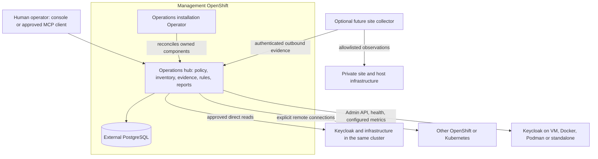

# Operator-managed installation and portable operations

Status: **accepted direction; not implemented**. [ADR 0012](../adr/0012-operator-managed-portable-platform.md)
records the decision. The [installation contract](operator-installation-contract.md)
is draft **0.1**, not an installed CRD, stable API or release.

## Responsibility and deployment boundaries

These are responsibility boundaries, not a mandate to split the backend into
microservices. Initially add only the installation controller as a separate process.
Keep UI/REST/MCP on shared application services. PostgreSQL stores registry/history/
audit and future coordination, not a replacement metrics time-series database.
AI remains optional and receives authorized projections, not credentials or raw
provider APIs. The installation API does not expand AGT1/AGT2 exposure.

The installation controller owns only product resources. The official Keycloak/RHBK
Operator, GitOps, Compose or system manager remains owner of the evaluated runtime.
Observing a resource never adds an ownerReference to it. Future remediation belongs
to the independently governed change workflow and original desired-state source.

## Current code versus proposed capabilities

| Boundary | Existing evidence | Remaining work |
|---|---|---|
| Logical environment | [Target](../../src/main/java/io/github/keycloakmcp/target/Target.java) separates Keycloak, infrastructure and metrics | One infrastructure binding today; multi-installation environments need a new model/migration |
| Explicit cluster access | [Client factory](../../src/main/java/io/github/keycloakmcp/adapter/infrastructure/InfrastructureClientFactory.java) and [configuration](../../src/main/java/io/github/keycloakmcp/adapter/infrastructure/ExplicitInfrastructureConfig.java) | Actual cluster/version acceptance; no ambient credentials or automatic cluster grants |
| Existing-target confirmation | [Onboarding service](../../src/main/java/io/github/keycloakmcp/service/platform/InstallationOnboardingService.java) | [ONB1](../milestones/onb1-environment-registry.md) registration, ownership and lifecycle |
| Administrative draft | [Preflight 0.1.0](../registry-preflight.md): default-closed REST, exact administrator/client, syntax and local collision checks only | Audited administrator bootstrap, registration and destination approval remain ONB1; no permission from installation |
| Registry definition ownership | [V11 foundation](registry-ownership.md): conservative legacy provenance, configuration owner, ORM revision and atomic system audit | Governed adoption/config-to-API transfer, public registration and populated upgrade acceptance remain ONB1 |
| Product installation | [OpenShift templates](../../deploy/openshift/README.md) only | Controller, CRD, lifecycle tests and packaging in OP1 |
| Availability | OpenShift template has one replica; MCP/SSE state is in process | Kubernetes template still declares two; harmonize baseline before Operator implementation, not a tested HA claim |
| Continuous work | [Scheduler](../../src/main/java/io/github/keycloakmcp/service/platform/LoggingScheduledOperationService.java) only logs | Durable execution, leases/idempotency, budgets and recovery before continuous fleet promises |
| VM/container infrastructure | [VM collector](../../src/main/java/io/github/keycloakmcp/collector/vm/VmEvidenceCollector.java) is disabled placeholder | PORT1/PORT2; local container-based API tests are not infrastructure collector acceptance |

No new runtime capability or compatibility is established by this document.

## Environment and connection model

Retain [Connection → Environment → Installation → Observation](portable-environment-discovery.md).
An OpenShift cluster can host many independent Keycloak environments. One logical
multi-site environment may eventually span several installations, each with its own
identity/evidence. The current one-binding target must not be relabelled as that
future 1:N model. Installation count, desired replicas and distinct targets are not
proof of HA or failover.

| Evaluated hosting | Application facts | Infrastructure facts |
|---|---|---|
| Same OpenShift | Approved Keycloak/management/metrics connections | Explicit service-account access and namespace/resource bindings; placement alone grants nothing |
| Other OpenShift/Kubernetes | Explicit reachable endpoints and separate credentials/CA | Each remote cluster grants its own scoped API access; no ambient kubeconfig |
| VM, standalone, Docker/Podman/Compose | Admin API and configured health/metrics when available and authorized | Future approved local collector or offline evidence; no inference from an application URL |
| Network-restricted site | Direct access only if policy permits | Optional outbound collector; fully disconnected means offline import with provenance limitations |

Every result distinguishes unsupported, unconfigured, denied, unreachable, stale,
ambiguous and observed. API discovery is not permission, and empty data is not
absence unless the scoped query is complete. Version/distribution applicability
and separate infrastructure/IAM/metrics coverage remain visible in reports/rating.

## Ownership and security

- CR/GitOps owns installation intent. UI/API owns explicitly managed registry objects.
  A future declarative registry adapter uses the same administrative contract;
  records have stable IDs, revisions and an explicit owner. Conflicting UI edits
  fail; ownership transfer is reviewed and audited. No controller writes directly
  into PostgreSQL or bypasses confirmation.
- Identity A authenticates platform users; Identity B accesses sources. Installer,
  backend and collectors have separate accounts. The UI has no cluster API token.
  Read/discovery/bind, model disclosure and remote mutation remain distinct powers.
- OP1 does not disable global read-only to make onboarding work. Current BIND is
  blocked by that gate. Any future separation of registry writes from remote writes
  needs an explicit ONB1 policy/ADR slice and negative tests before activation.
- Same-namespace references are not permission to read every Secret. Bound named
  references, administrator-controlled CR edits, minimal watches and sanitized errors
  are required. No arbitrary image, pod template, command, environment/property map,
  Docker/Podman socket or remote shell in the installation API.
- Plan egress, DNS, proxy and CA trust for approved IdP, database and source endpoints.
  Reject redirect/credential forwarding and unapproved destinations in onboarding.
  A route to the platform does not require publicly exposing target Admin APIs.

## Failure, evidence and collector boundaries

Platform availability, target health and collection coverage are different signals.
A remote target outage must not trigger platform liveness restarts or block other
targets. Collection has per-source/time/size/concurrency budgets and bounded retry;
future periodic work needs persisted attempts and coordination, not just timers.

Prefer a management cluster/IdP failure domain independent of critical evaluated
targets. Co-location is valid for a lab but cannot provide an independent view of
that cluster's complete outage. Hubs shared across targets are not proof of complete
multi-tenancy; use separate hubs for incompatible trust/regulatory domains.

Future collectors need independent installation approval, scoped identity, revocation/
rotation, a versioned evidence envelope, target/installation/collector binding,
collection time/freshness, replay protection, quotas and bounded local buffering.
They must sanitize before transmission and cannot receive arbitrary model-generated
code. Offline imports must not trigger network requests or execution. A checksum
alone establishes neither trusted origin nor live state. Federation is deferred.

## Delivery and acceptance

1. This design/contract slice: documentation only; no installation commands.
2. Preserve H1/D1 review and reproduction; follow the ONB1 ownership foundation with
   governed adoption/transfer and minimum registration. ONB1 blocks an onboarded
   workflow, not an empty OP1 installation. Consolidate deployment settings, OIDC UI configuration and
   the one-replica limitation before controller rollout.
3. Validate [D2](../milestones/d2-rhbk-openshift.md) on the explicitly approved lab
   using reviewed manifests. OP1 is not a prerequisite for the presentation.
4. [OP1](../milestones/op1-operator-installation.md): controller, installation and
   lifecycle acceptance. An empty installation is not a registered/evaluated fleet.
5. Extend the declared matrix: two Keycloaks in one cluster, another approved
   cluster, and VM/container application access; test denial and isolated failure.
   Infrastructure completeness requires the respective PORT1/PORT2 acceptance.
6. P4 governs supported topology, backup/restore, upgrades, retention and HA claims;
   Operator catalogue delivery is accepted only through the exact tested path.

These stages introduce no new calendar commitment and do not close existing gates.
