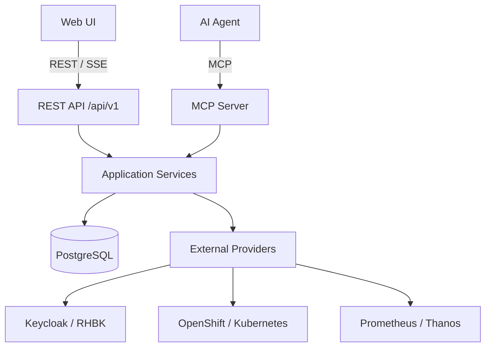
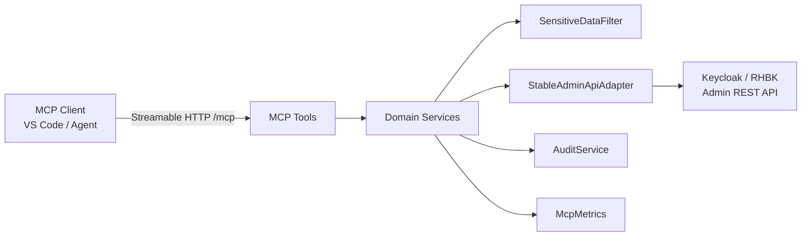
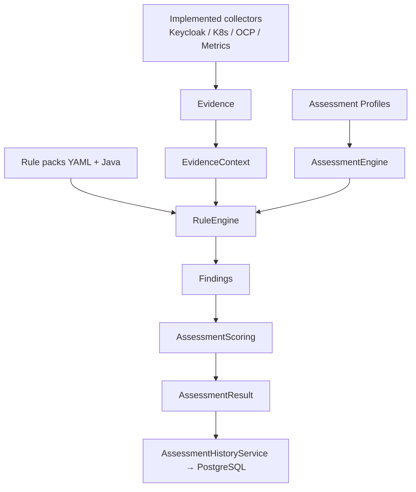
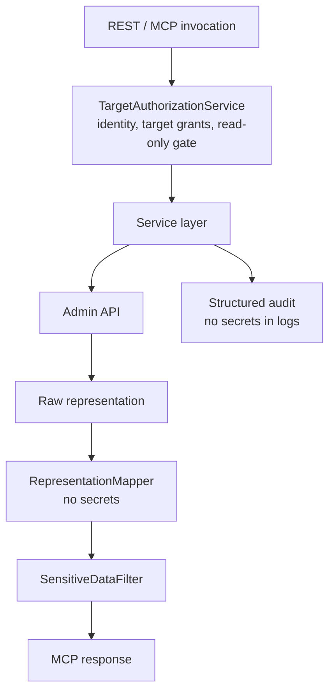

# Architecture overview

`keycloak-operations-mcp` is evolving into a **Keycloak / RHBK Operations Platform**
backend: MCP + REST share the same application services, with PostgreSQL for
operational history (not time-series metrics).

Installation direction: a separate [Operations Operator](operator-managed-platform.md)
will reconcile only the platform's lifecycle, leaving the modular hub and target
connections portable. [Draft installation contract 0.1](operator-installation-contract.md)
and [OP1](../milestones/op1-operator-installation.md) are design, not implemented
controller/CRD/HA support. Existing Keycloak/RHBK Operators remain target owners.

## Platform overview



REST Controllers and MCP Tools must never reimplement Keycloak access logic —
both call the same services (for example `ClientService`, `AssessmentHistoryService`).

Local acceptance uses a [disposable identity/browser lab](../../dev/identity-lab/README.md): an independent platform IdP (Identity A), two Keycloak targets with separate service credentials (Identity B), and transient PostgreSQL. Browser REST/SSE and MCP exercise the existing shared services; no extra agent/model runtime or cluster collector is introduced. The metrics-disabled scenario explicitly overrides inherited endpoints; absent telemetry is not a healthy observation.

The local harness is not a product runtime adapter: Bash entry points share a Node process supervisor and a narrowly scoped Podman lifecycle helper. It pins an explicitly selected local machine endpoint, bounds commands/readiness/checks, labels each execution, and validates full resource identities before cleanup. Unconfirmed cleanup preserves the ownership lock; no automatic VM restart, global prune or REST/MCP shell surface is introduced. See the [runner ledger](../development/d1-runner-hardening-2026-09-18.md).

## High-level components

Process cleanup treats failed group probes as unknown until the bounded final observation. Independently verified absence can resolve a transient host error; persistent uncertainty retains the lab lock. The [19 September runner validation](../development/d1-runner-validation-2026-09-19.md) records this lifecycle correction and its tests.

The logical environment is independent of hosting. The accepted [portable discovery design](portable-environment-discovery.md) separates connections, environment targets, installation bindings and inventory observations, with independent hosting/runtime/deployment dimensions. Kubernetes/OpenShift inventory exists; VM/physical-host, Docker/Podman/Compose and standalone host collectors remain staged work. Keycloak API assessments must not require those infrastructure collectors.

The first cluster capability reconciliation slice retains configured runtime and
observed API versions separately. The same bounded discovery result drives Route/config
collection; a shared completeness policy propagates gaps through assessment,
snapshots/reports and infrastructure API health. Advertised APIs are not authorization
or successful resource observations; legacy missing coverage stays incomplete.
See [implementation evidence](../development/h1-capability-coverage-2026-09-19.md).

| Layer | Responsibility |
|-------|----------------|
| MCP Tools | Thin Quarkiverse `@Tool` facade (`keycloak_*`) |
| REST API | Versioned `/api/v1` for Fleet / overview / history |
| Services | Domain orchestration, reporting, audit, metrics, persistence |
| Persistence | JPA entities + Flyway (targets, assessments, health, audit, snapshots) |
| Adapters | Keycloak Admin Client (stable API); OpenShift/Kubernetes inventory; VM future |
| Observability | `MetricsProvider` / factory (semantic queries; no raw PromQL tools); performance evidence |
| Security | Sensitive data redaction, read-only enforcement, target authz |

## Administration

The [configuration ownership foundation](registry-ownership.md) adds V11 conservative
owner metadata and ORM registry revisions. Only explicitly CONFIGURATION-owned rows
are reconciled; normalized no-op is write/audit-free, while changes and mandatory
system audit share a transaction. Legacy/config collisions fail without adoption;
database/composite never silently falls back to configuration. This does not enable
public registration or alter global read-only/BIND or the separate binding revision.

The initial [ONB1 preflight](../registry-preflight.md) is a separate REST-only path:
`RegistryPreflightResource` → `RegistryPreflightService` → explicit administrator
policy, bounded validator and local configuration/database collision reads. It has
no provider, credential-resolution or write path. This default-closed contract 0.1.0
does not bootstrap grants, reserve IDs, register connections or approve destinations.
[ADR 0013](../adr/0013-registry-preflight-before-registration.md) preserves operational
endpoint binding and global read-only/BIND semantics; full ONB1 remains partial.

For installation onboarding, the implemented path is the Installation UI → `InstallationResource` → `InstallationOnboardingService`. It operates on an **existing persisted target** with an approved connection; it does not create targets, credentials or cluster resources. `InstallationCandidateCollector` lists scoped metadata and revalidates UID. `InfrastructureClientFactory` resolves explicit credentials. `InventoryService` and `InstallationNetworkingCollector` use identity/ownership and Service/backend associations, not first-match names.

Discovery requires READ + DISCOVER; confirmation additionally requires BIND and global read-only disabled. Under a target row lock, the binding/revision update, expiring run consumption and mandatory success audit share a transaction. PostgreSQL V9–V10 stores this state. This confirmation slice exposes REST/UI, **not** a new MCP confirmation tool. Remote reads are not an atomic cluster snapshot; UI acknowledgment does not prove human presence.

Networking describes configuration, not connectivity, certificate validity or controller admission. Full connection/target registration and host/container collectors remain planned. See [portable discovery](portable-environment-discovery.md), [confirmation contract and evidence](../development/installation-onboarding-2026-09-11.md), [networking limitations](../development/installation-networking-2026-09-11.md) and [persistence](persistence.md).



Design rules:

- Tools never call the Admin Client directly.
- `AdminApiV2Adapter` exists only as a documented non-primary path and returns
  `UNSUPPORTED_CAPABILITY` when unused.
- Client secrets are never mapped into `ClientDetails`.
- Credentials are referenced via `credentialRef` only — never stored in PostgreSQL plaintext.
- Operational tools are **read-only by default**. Controlled writes use the accepted
  plan → approve → apply → verify lifecycle and require explicit authorization.
## Assessment



Assessment consumes **normalized evidence keys** (for example `deployment.replicas`),
not raw Kubernetes objects. Health checks and assessments are distinct concepts:
health evaluates implemented operational checks; assessment evaluates deterministic rules against scoped evidence. Neither is universal proof of availability or production readiness, and missing evidence must remain explicit.

The Admin API health component separates metadata endpoint reachability from missing version metadata and access/authentication gaps, using bounded messages and stable reason codes (see [health semantics](../health-check.md)). Overview projection returns nullable infrastructure counts from stored inventory/warnings; the UI preserves observed zeros and labels missing values explicitly. This projection does not mutate historical snapshots or redefine raw inventory sentinel contracts.

## Reporting and AI assistance

`OperationsReportService` composes snapshots, health, assessment, findings, and semantic metrics into one sanitized target report shared by REST and MCP. Report completeness is separate from health and assessment status; provider gaps remain explicit.

A synchronous target-bound `CollectionBudget` now spans nested collection stages.
It preserves validated partial evidence and prevents new reads after expiry, without
moving work/identity to background threads. This is not a hard persistence/rendering
deadline or an atomic snapshot; see the reporting contract for remaining boundaries.

AI agents orchestrate typed MCP tools and explain deterministic facts. They do not own health, scoring, authorization, risk, policy, approval, apply, or verification decisions. See [operations-reporting.md](operations-reporting.md), [ai-assisted-operations.md](ai-assisted-operations.md), and [ADR 0008](../adr/0008-ai-assists-backend-decides.md).

## Security



Two identities: operators authenticate to the platform (Identity A / OIDC implemented,
with PKCE in the UI; full browser/IdP acceptance remains open);
the platform authenticates to Targets via `credentialRef` (Identity B). See
[identity-model.md](../identity-model.md).

## Runtime modes

- **Streamable HTTP** (default): Quarkus on port `8081`, MCP endpoint `/mcp`,
  management port `9001` for health/metrics/OpenAPI (local compose reserves `9000` for Keycloak).
- **STDIO**: Maven profile `stdio` for local desktop MCP hosts.
- **REST**: `/api/v1/*` on the application port, consumed by the implemented Web UI.

## Package layout (simplified)

```
io.github.keycloakmcp
├── api/v1/         # REST controllers
├── mcp/            # Tool entry points
├── service/        # Business + platform services
├── persistence/    # JPA entities, repositories, mappers
├── adapter/        # Keycloak and explicit cluster adapters; host/container adapters future
├── security/       # Redaction + authorization
├── discovery/      # Environment detection
├── collector/      # Evidence collectors
├── assessment/     # Engine, profiles, scoring
├── domain/         # Immutable DTOs + errors
├── audit/          # Structured audit (+ DB persister)
├── observability/  # Micrometer + MetricsProvider
├── target/         # Multi-target registry
└── config/         # ConfigMapping interfaces
```
