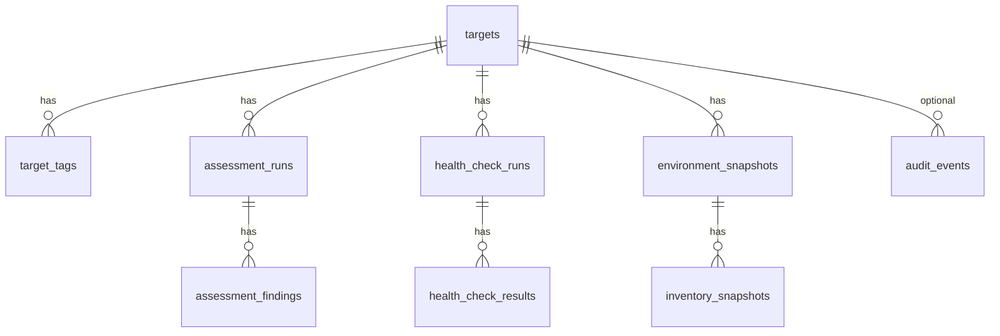

# Database schema

See Flyway migrations in `src/main/resources/db/migration/`.

## ER overview

## Notable columns

- **targets**: credential **refs** only; `observability` JSONB
- **assessment_findings**: `engine_status` (OPEN/PASS/WARNING/FAIL/…) + `lifecycle_status`; optional `resource_type` / `resource_id` / `resource_name` (V6)
- **assessment_runs**: V6 adds `evidence_completeness`, `confidence`, `category_scores`, rule counters
- **health_check_results**: V6 adds `duration_ms`
- **audit_events**: `trace_id`, sanitized `params` JSONB
- **environment_snapshots**: `snapshot_hash` SHA-256 of normalized summary

Indexes: `target_id`, `created_at`, `assessment_id`, `severity`, `status`/`lifecycle_status`, `trace_id`.
