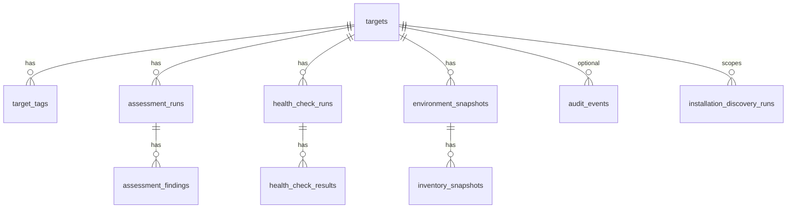

# Database schema

See Flyway migrations in `src/main/resources/db/migration/`.

## ER overview

```mermaid
erDiagram
  targets ||--o{ target_tags : has
  targets ||--o{ assessment_runs : has
  assessment_runs ||--o{ assessment_findings : has
  targets ||--o{ health_check_runs : has
  health_check_runs ||--o{ health_check_results : has
  targets ||--o{ environment_snapshots : has
  environment_snapshots ||--o{ inventory_snapshots : has
  targets ||--o{ audit_events : optional
  targets ||--o{ installation_discovery_runs : scopes
```

## Notable columns

- **targets**: credential **refs** only; `observability` JSONB; V9 installation API/kind/name/UID; V10 `installation_revision` and `installation_managed`; V11 `registry_owner` (CONFIGURATION or LEGACY_UNCLASSIFIED) and nonnegative `registry_revision` (`@Version`, separate from the binding counter)
- **installation_discovery_runs** (V10): target FK, trusted actor, context hash, binding revision, expiry, consumed flag and allowlisted candidate JSONB; not credentials or raw resource dumps
- **assessment_findings**: `engine_status` (OPEN/PASS/WARNING/FAIL/…) + `lifecycle_status`; optional `resource_type` / `resource_id` / `resource_name` (V6)
- **assessment_runs**: V6 adds `evidence_completeness`, `confidence`, `category_scores`, rule counters
- **health_check_results**: V6 adds `duration_ms`
- **audit_events**: `trace_id`, sanitized `params` JSONB
- **environment_snapshots**: `snapshot_hash` SHA-256 of normalized summary
- **change_records** (V7/V8): target-scoped lifecycle, normalized operations/diff, idempotency, baseline/approval/policy/context/integrity fingerprints and trusted actor fields. V7 indexes `target_id` but does not declare a target FK; service authorization remains required

Indexes: `target_id`, `created_at`, `assessment_id`, `severity`, `status`/`lifecycle_status`, `trace_id`.

V11 preserves previous values/relationships and classifies all old targets as
LEGACY_UNCLASSIFIED/0, not automatically configuration-owned. Populated upgrades need
an approved adoption/restore procedure when configuration collides with old IDs; no
bulk takeover or mixed-version writer support. See [ownership](architecture/registry-ownership.md).
