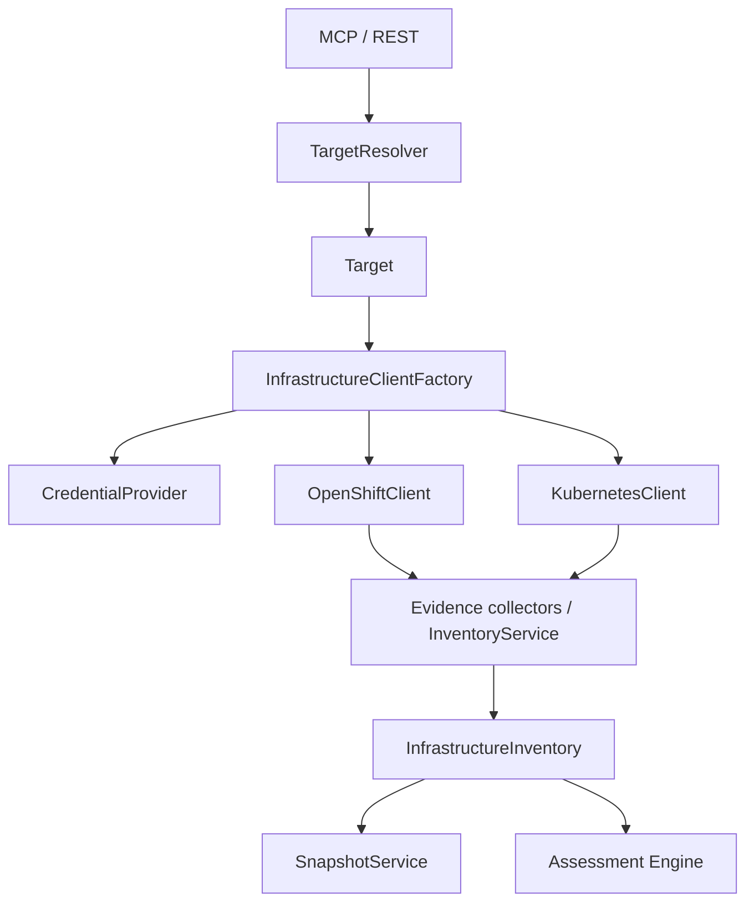

# Infrastructure inventory

`InventoryService` builds a sanitized {@code InfrastructureInventory} for a registered Target.



## Binding

Infrastructure is resolved only from Target config:

```properties
mcp.targets.customer-a-prd.infrastructure.type=OPENSHIFT
mcp.targets.customer-a-prd.infrastructure.namespace=rhbk
mcp.targets.customer-a-prd.infrastructure.credential-ref=ocp-a
mcp.credentials.ocp-a.token=${OCP_A_TOKEN}
mcp.credentials.ocp-a.api-server-url=${OCP_A_API}
mcp.credentials.ocp-a.trust-insecure=false
```

MCP/REST callers pass **only** `targetId`.

## Auth modes

See [infrastructure-authentication.md](infrastructure-authentication.md).

## Partial collection

API failures become `CollectionWarning` codes (`PERMISSION_DENIED`, `API_UNAVAILABLE`, …).
Collected sections are still returned.

## REST / MCP

- `GET /api/v1/targets/{targetId}/inventory`
- `GET /api/v1/targets/{targetId}/environment`
- `GET /api/v1/targets/{targetId}/topology`
- MCP `keycloak_get_inventory`
- MCP `keycloak_discover_environment` (target-aware)
