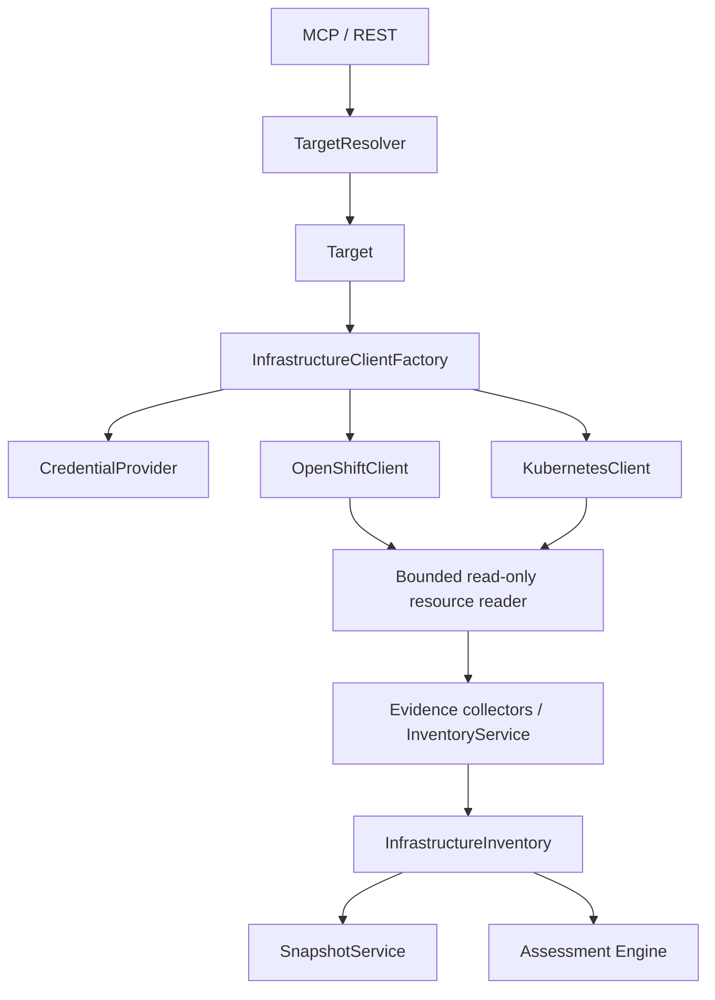

# Infrastructure inventory

`InventoryService` builds a sanitized `InfrastructureInventory` for a registered Target.


```mermaid
flowchart TB
  MCP["MCP / REST"] --> Resolver[TargetResolver]
  Resolver --> Target[Target]
  Target --> Factory[InfrastructureClientFactory]
  Factory --> Creds[CredentialProvider]
  Factory --> OC[OpenShiftClient]
  Factory --> KC[KubernetesClient]
  OC --> Reader[Bounded read-only resource reader]
  KC --> Reader
  Reader --> Collectors[Evidence collectors / InventoryService]
  Collectors --> Inv[InfrastructureInventory]
  Inv --> Snap[SnapshotService]
  Inv --> Assess[Assessment Engine]
```

## Binding

Infrastructure is resolved only from Target config:

```properties
mcp.targets.customer-a-prd.infrastructure.type=OPENSHIFT
mcp.targets.customer-a-prd.infrastructure.cluster-id=approved-cluster-a
mcp.targets.customer-a-prd.infrastructure.namespace=rhbk
mcp.targets.customer-a-prd.infrastructure.credential-ref=ocp-a
mcp.credentials.ocp-a.token=${OCP_A_TOKEN}
mcp.credentials.ocp-a.api-server-url=${OCP_A_API}
mcp.credentials.ocp-a.trust-insecure=false
```

MCP/REST callers pass **only** `targetId`.

Workload inventory additionally requires the exact installation's `api-version`, `kind`, `name` and `uid` under `infrastructure.installation`, or a platform-managed binding confirmed for an existing persisted target. Obtain values from the approved environment; never copy a made-up UID. Unbound targets return BINDING_REQUIRED, not the first workload in a namespace. Deployment/StatefulSet/Keycloak roots are revalidated; pods follow ownership. Services use exclusive selector associations; Ingress/Route backends must match those Services. Ambiguity remains a gap.

Networking is configuration evidence, not proof of connectivity, valid certificates or controller admission. VM/physical-host, Docker/Podman/Compose and standalone collectors are not implemented. See [portable discovery](architecture/portable-environment-discovery.md) and [confirmation](development/installation-onboarding-2026-09-11.md).

## Auth modes

See [infrastructure-authentication.md](infrastructure-authentication.md).

## Partial collection

API failures become `CollectionWarning` codes (`PERMISSION_DENIED`, `API_UNAVAILABLE`, …).
Messages are fixed by code; provider errors/URLs are discarded and resource names
are allowlisted. Unknown resource identifiers become null, indicating opaque
failure rather than a trusted resource label. Deserialization applies the same
normalization; existing persisted payload bytes are not rewritten.

Collected sections are still returned. Legacy primitive count/boolean fields must
be interpreted together with warnings, not as proof of observed absence.
`InventoryService.toEvidence` withholds facts dependent on missing/denied sections,
keeps independent observations and emits `infrastructure.collection.complete`.
Absent pods, incomplete node/zone placement, negative counters, missing container
status and incomplete networking cannot establish healthy zero/false conclusions.
Genuine zero replicas/pods and observed absent HPA/PDB remain valid evidence.
Single-zone concentration compares observed pod zones to known cluster zones.
Custom-resource replica counts require exact nonnegative integers; fractional,
nonfinite and overflowing numbers are unknown, not truncated counts.

Failed or incomplete collection does not become an empty successful list. Known
independent sections survive, while dependent evidence remains unavailable and
collection is partial. Node observations are reused within an inventory run rather
than fetched again for pod-zone mapping. Completeness describes the implemented
collector's required observations, not exhaustive cluster coverage or an atomic
snapshot. The [inventory/temporal evidence](development/h1-evidence-temporal-2026-09-18.md)
records the earlier evidence-projection correction.

## Response and collection limits

Cluster reads use fixed allowlisted resource paths over the approved client's
existing TLS/authentication. Factory-created clients disable redirects and request
retries. Namespaced reads use the explicitly checked target/cluster scope; no
ambient kubeconfig, namespace or credential fallback is introduced.

Each response is capped at 1 MiB and at most five seconds, or a lower configured
request timeout. Parsing also bounds nesting, strings, numbers and container size.
Inventory lists accept at most 500 objects per resource list; candidate discovery
has a combined 100-candidate ceiling, and ServiceMonitor lists accept at most 100.
Requests ask for one extra entry to detect overflow. API discovery separately
accepts at most 100 groups with 32 served versions each. Exceeding a limit is an
incomplete observation, not a silently truncated successful result.

Before model conversion, lists require their actual expected API/kind envelope,
metadata and explicit `items` array. Missing fields are not repaired by Fabric8
list defaults. Continuation, nonzero remaining counts, duplicate names/UIDs,
foreign namespaces and malformed identities are rejected. Typed-list items may
omit `apiVersion`/`kind` because the validated outer list supplies their type;
explicit null or conflicting item types are rejected. Individual resource GETs
require their own matching envelope and exact requested identity. Interrupted or
late observations cannot supply successful evidence.

The subsequent shared `CollectionBudget` caps these requests by the remaining
inventory/report collection time. Inventory preserves valid earlier sections and
adds a `collection-budget` warning on expiry/interruption; dependent missing sections
remain unknown. Discovery cannot turn a late absence response into a platform claim.
Candidate discovery also checks an existing scope, but does not invent a target
identity when called independently. This is not a full Kubernetes schema/metadata
sanitizer or hard response-time SLA. Larger legitimate environments or
responses may therefore be partial; the collector does not follow pagination to
claim complete coverage. Candidate discovery fails without publishing a partial
candidate set. See the [inventory-envelope ledger](development/h1-inventory-envelopes-2026-09-18.md)
for implementation and validation status; no live-cluster acceptance is implied.

## REST / MCP

- `GET /api/v1/targets/{targetId}/inventory`
- `GET /api/v1/targets/{targetId}/environment`
- `GET /api/v1/targets/{targetId}/topology`
- MCP `keycloak_get_inventory`
- MCP `keycloak_discover_environment` (target-aware)
