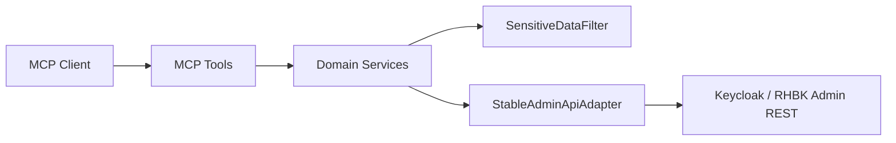

# Milestone 0.1 — Keycloak Admin Read-only

## Status

**COMPLETED** (conceptually; see Git note)

| | |
|--|--|
| Version | `0.1.0` (`pom.xml` at commit `7270d34`) |
| Commit | `7270d34` — *Initial commit: Keycloak/RHBK Operations Platform backend.* |
| Build / tests | Not separately recorded for 0.1 alone (bundled initial tree). HEAD baseline: see [`../project-state.md`](../project-state.md). |

**Git note:** Roadmap milestones **0.1–0.3** were delivered together in a single initial commit (`7270d34`) under artifact version **0.1.0**. There are no separate Git tags/commits for 0.1 vs 0.2 vs 0.3. This document isolates the **admin read-only MCP foundation** that that commit introduced.

**Tracking note:** An unanchored `.gitignore` entry `target/` initially excluded the Java package `io.github.keycloakmcp.target`. Those sources were restored in `a5a8d08` (after 0.4). Multi-target types were intended from the start (CHANGELOG / message) but were not present in the Git tree until that fix.

## Objective

Provide a secure MCP foundation to **read** Keycloak / RHBK Admin data (realms, clients, users, groups, roles, server info) without exposing arbitrary URLs or secrets to the LLM.

## Requirements

- FR-ADMIN-001 … FR-ADMIN-003
- FR-TARGET-001 (as tools became target-bound with multi-target)
- SEC-CRED-002, SEC-CRED-003, SEC-CRED-005, SEC-RO-001
- COMPAT-001 … COMPAT-004
- ADR [0002](../adr/0002-admin-rest-as-keycloak-integration-boundary.md)

## Context

Greenfield repository. No prior Operations Platform backend.

## Scope

Delivered in `7270d34` (admin / MCP slice):

- Quarkus **3.38.1** application, Quarkiverse MCP Server (HTTP; optional STDIO profile)
- Keycloak Admin Client adapter (`StableAdminApiAdapter`, `KeycloakClientFactory`)
- Read-only MCP tools for realms, clients, users, groups, roles, server info
- Product / version / capability detection (`KeycloakVersionDetector`, capabilities)
- Sanitized DTOs; `SensitiveDataFilter`
- Default read-only mode (`mcp.read-only`)
- Local Keycloak via `dev/compose.yaml`
- Unit tests for services, redaction, version/capability detection
- Deploy manifests (OpenShift/Kubernetes) with read-oriented RBAC placeholders

Also present in the same commit but documented under **0.2 / 0.3**: multi-target registry design, PostgreSQL, REST `/api/v1`, assessment stubs, etc.

## Architecture



See [`../architecture.md`](../architecture/overview.md).

## Main Components

| Component | Responsibility |
|-----------|----------------|
| MCP `*Tools` | Thin `@Tool` facades |
| `*Service` | Domain orchestration |
| `StableAdminApiAdapter` | Primary Admin REST path |
| `KeycloakVersionDetector` / capabilities | Product + feature detection |
| `SensitiveDataFilter` | Redact secrets from responses/logs |

## MCP Changes

**Added (read-only, require registered target):** server info, realms, clients, users, groups, roles tools (see [`../tools.md`](../tools.md)).

No write tools. No raw Admin REST proxy tool.

## REST Changes

REST `/api/v1` appeared in the same initial commit — attributed to **0.3**.

## Persistence Changes

Flyway + platform tables — attributed to **0.3**.

## Security Considerations

- Read-only by default
- No arbitrary Keycloak URLs from LLM (target binding)
- Secrets never returned in DTOs / filtered outbound
- Audit hooks with sanitized mode

## Tests

Unit coverage for adapter/services/redaction/version detection introduced in initial tree. Exact per-milestone test delta not separable in Git (single commit).

## Acceptance Criteria

- [x] Quarkus MCP server runs (HTTP; STDIO profile available)
- [x] Keycloak Admin Client read path for realms/clients/users/groups/roles/server info
- [x] Capability / version / product detection
- [x] Sanitized DTOs + `SensitiveDataFilter`
- [x] Read-only default; no write MCP tools
- [x] Local Keycloak compose for demos
- [x] Unit tests for core admin/security paths

## Validation

```bash
mvn clean verify
# Optional: scripts/smoke-mcp.sh with compose Keycloak
```

## Known Limitations

- RHBK images not auto-tested without registry credentials
- Assessment / inventory / metrics were stubs or foundations only
- Target package tracking gap until `a5a8d08` (see Git note)

## Deferred

- Real OpenShift/Kubernetes inventory → **0.4**
- Health/assessment depth → **0.5**
- Real Prometheus integration → **0.6**
- Web UI → **0.7**

## Related Documentation

- [`../tools.md`](../tools.md)
- [`../security.md`](../architecture/security.md)
- [`../compatibility.md`](../compatibility.md)
- [`../../CHANGELOG.md`](../../CHANGELOG.md) section `[0.1.0]`

## Next Milestone

[0.2 — Multi-target](0.2-multi-target.md)
