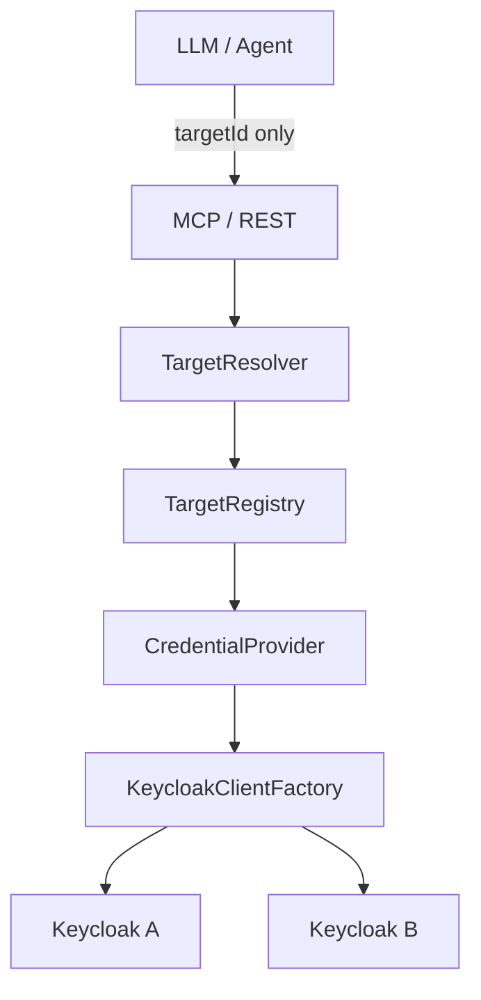

# Milestone 0.2 — Multi-target

## Status

**COMPLETED** (conceptually; see Git note)

| | |
|--|--|
| Version | Shipped inside `0.1.0` initial tree (`7270d34`); SemVer did not bump to `0.2.x` |
| Commit | Design/content intended in `7270d34`; **Target package sources first tracked in** `a5a8d08` (*Fix gitignore so the Java target package is tracked.*) |
| Build / tests | Isolation tests exist at HEAD (`MultiTargetIsolationTest`, persistence isolation, etc.). No separate `0.2` release commit. |

**Git note:** There is **no** dedicated `0.2` commit. Multi-target was part of the initial platform design. Because `.gitignore` used unanchored `target/`, `io.github.keycloakmcp.target` sources were missing from `7270d34` and `64a0f8c` on Git until `a5a8d08`.

## Objective

Allow one Operations MCP/REST backend to administer **many** Keycloak/RHBK environments safely via opaque `targetId`, never via LLM-supplied URLs or credentials.

## Requirements

- FR-TARGET-001 … FR-TARGET-004
- SEC-TARGET-001, SEC-TARGET-002, SEC-CRED-001, SEC-MULTI-001
- NFR-ISO-001
- ADR [0001](../adr/0001-multi-target-by-design.md), [0004](../adr/0004-no-arbitrary-endpoints-from-mcp.md)

## Context

After (and alongside) 0.1 admin tools, every call must bind to a registered target with isolated credentials.

## Scope

- `Target`, `TargetId`, `TargetRegistry` / `ConfigurationTargetRegistry` / `CompositeTargetRegistry` / `DatabaseTargetRegistry`
- `TargetResolver`, `TargetAuthorizationService`
- `CredentialProvider` + `credentialRef` (Keycloak credentials not accepted from LLM)
- `KeycloakClientFactory` creates per-target Admin clients
- MCP: `keycloak_list_targets`, `keycloak_get_target`, `keycloak_find_targets`
- All admin tools require `targetId`
- Multi-target isolation tests
- Lab dual Keycloak profile (`lab-keycloak-a` / `lab-keycloak-b`) in compose docs

## Architecture



**Hard rule:** `LLM → targetId`. Never `LLM → arbitrary URL / token`.

See [`../multi-target.md`](../architecture/multi-target.md).

## Main Components

| Component | Responsibility |
|-----------|----------------|
| `TargetRegistry` | Resolve registered targets |
| `TargetResolver` | Require/find by id |
| `TargetAuthorizationService` | Permission checks |
| `CredentialProvider` | Resolve secrets by `credentialRef` |
| `KeycloakClientFactory` | Per-target Admin client lifecycle |

## MCP Changes

- Added target listing/get/find tools
- Existing admin tools become target-aware (`targetId` required)

## REST Changes

Target CRUD/list surfaces under `/api/v1/targets` (same initial platform commit) — shared service layer.

## Persistence Changes

Targets table / bootstrap — part of Flyway V1 (see **0.3**).

## Security Considerations

- Credential isolation between targets
- Target authorization before operations
- SSRF mitigation: only registered endpoints
- Secrets never echoed in target summaries

## Tests

- `MultiTargetIsolationTest`, `TargetResolverTest`, `TargetRegistryTest`, `TargetAuthorizationTest`, persistence multi-target isolation
- Exact historical count at “0.2 completion” not available (no dedicated commit)

## Acceptance Criteria

- [x] Multi-target registry and resolver
- [x] Operations bound to `targetId`
- [x] Credentials via `credentialRef` / providers only
- [x] Target MCP tools
- [x] Isolation tests
- [x] Target package tracked in Git (`a5a8d08`)

## Validation

```bash
mvn clean verify
```

## Known Limitations

- Git history for 0.2 is not a clean SemVer tag; reconstruct from docs + `a5a8d08` + initial CHANGELOG
- Infrastructure/observability bindings existed as config shapes; real clients came later (0.4 / 0.6)

## Deferred

- Real cluster inventory → **0.4**
- Full assessment depth → **0.5**
- Metrics providers → **0.6**

## Related Documentation

- [`../multi-target.md`](../architecture/multi-target.md)
- [`../security.md`](../architecture/security.md)
- [`../identity-model.md`](../identity-model.md)

## Next Milestone

[0.3 — Persistence & Operations Platform Foundation](0.3-platform-foundation.md)
