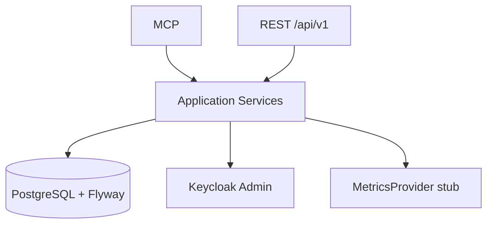

# Milestone 0.3 — Persistence & Operations Platform Foundation

## Status

**COMPLETED** (conceptually; see Git note)

| | |
|--|--|
| Version | Shipped inside `0.1.0` (`7270d34`); no `0.3.x` pom bump |
| Commit | `7270d34` — initial platform backend (persistence + REST + history foundations) |
| Build / tests | Persistence / REST tests introduced in initial tree (e.g. repository tests, `FleetResourceTest`, `TargetResourceTest`). No dedicated 0.3 commit. |

**Git note:** Roadmap called this **0.3**, but Git only has the bundled initial commit before **0.4.0-SNAPSHOT**.

## Objective

Turn the MCP admin tool into an **Operations Platform backend**: PostgreSQL history, REST `/api/v1` for a future console, and shared services for assessments, health, audit, snapshots, and (stub) metrics.

## Requirements

- FR-PERS-001, FR-REST-001, FR-MCP-001, FR-AUDIT-001, FR-HEALTH-002
- FR-ASSESS-001 (foundation), FR-METRICS-001 (abstraction only at this stage)
- NFR-TSDB-001
- ADR [0005](../adr/0005-postgresql-is-not-a-tsdb.md)

## Context

0.1/0.2 provide live Keycloak reads via MCP. Operators also need durable history and a REST surface independent of LLM sessions.

## Scope (verified in `7270d34` / still present)

- PostgreSQL + Flyway: `V1`–`V5` (targets, assessments, health, audit, snapshots)
- JPA entities / repositories / mappers
- Assessment history persistence + engine **foundation** (Evidence → Rules → Findings → Scoring stubs/samples)
- Health check **service** (lightweight Admin reachability) + tables — not yet the full `HealthCheckEngine` of 0.5
- Audit persistence + `AuditService`
- Snapshot tables/service foundations
- REST `/api/v1`: fleet, targets, overview, assessments, findings, health-checks, snapshots, audit, metrics stubs, events SSE stub
- `MetricsProvider` **abstraction** + stub/empty Prometheus provider (no real scrape stack yet)
- Scheduler dependency present (`quarkus-scheduler`) — foundation, not a full ops scheduler product
- UI architecture docs only (`docs/ui-architecture.md`, `docs/ui/*`) — **no Web UI app**

## Architecture



PostgreSQL stores operational history — **not** time-series samples. See [`../persistence.md`](../architecture/persistence.md), [`../database-schema.md`](../database-schema.md).

## Main Components

| Component | Responsibility |
|-----------|----------------|
| Flyway migrations V1–V5 | Schema bootstrap |
| `*Repository` / entities | Persistence |
| `AssessmentHistoryService` | Store/load assessments |
| `HealthCheckService` | Lightweight health runs + history |
| `AuditService` / persister | Tool/API audit |
| `SnapshotService` | Snapshot persistence foundation |
| REST resources under `api.v1` | Console-oriented API |
| `MetricsProvider` | Future metrics (stub in 0.3) |

## MCP Changes

Assessment discovery tool existed (`keycloak_discover_environment`). Full assessment/health MCP suite expanded in **0.5**.

## REST Changes

Introduced `/api/v1` surfaces for fleet, targets, overview, assessments, findings, health, snapshots, audit, metrics placeholders, SSE events stub (`EventsResource` hello/heartbeat only).

## Persistence Changes

| Migration | Purpose |
|-----------|---------|
| V1 | Initial / targets |
| V2 | Assessment tables |
| V3 | Health check tables |
| V4 | Audit |
| V5 | Snapshots |

## Security Considerations

- Sanitized audit mode; filter before persist/respond
- Credentials not stored plaintext in DB (`credentialRef`)
- Target authz on platform services

## Tests

Persistence repository tests, secret-leakage persistence test, multi-target persistence isolation, basic REST resource tests — introduced with initial tree. Exact count at “0.3” not separable.

## Acceptance Criteria

- [x] PostgreSQL + Flyway V1–V5
- [x] Assessment / health / audit / snapshot persistence foundations
- [x] REST `/api/v1` fleet/history surfaces
- [x] Shared services for MCP + REST
- [x] MetricsProvider abstraction (stub)
- [x] UI architecture docs (no UI code)
- [x] SSE endpoint stub present

## Validation

```bash
mvn clean verify
```

## Known Limitations

- Inventory/infra clients were stubs (`InfrastructureClientFactory` threw unsupported)
- Metrics not real (empty/unsupported without endpoint; no PromQL builder stack yet)
- Health was Admin reachability–oriented, not full component engine
- Assessment rules were sample/minimal vs later depth
- SSE is heartbeat stub, not domain event bus
- Scheduler library present; scheduled assessments productized later (roadmap 0.9)

## Deferred

- Real OCP/K8s inventory → **0.4**
- Assessment/health depth → **0.5**
- Prometheus/performance → **0.6**
- Web UI → **0.7**
- Drift / schedules / alerts → **0.8+**

## Related Documentation

- [`../persistence.md`](../architecture/persistence.md)
- [`../rest-api.md`](../rest-api.md)
- [`../audit.md`](../audit.md)
- [`../snapshots.md`](../snapshots.md)
- [`../ui-architecture.md`](../ui-architecture.md)
- [`../observability-integration.md`](../observability-integration.md)

## Next Milestone

[0.4 — Infrastructure Discovery](0.4-infrastructure-discovery.md)
