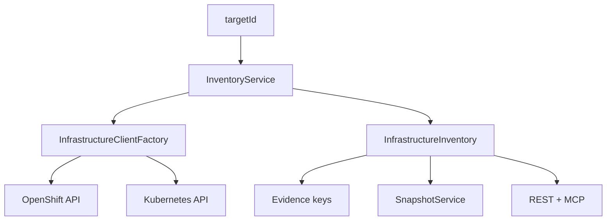

# Milestone 0.4 — OpenShift / Kubernetes Discovery & Infrastructure Inventory

## Status

**COMPLETED**

| | |
|--|--|
| Version | `0.4.0-SNAPSHOT` |
| Commit | `64a0f8c` — *Add OpenShift/Kubernetes discovery and infrastructure inventory (0.4).* |
| Follow-up | `a5a8d08` — restore `io.github.keycloakmcp.target` package tracking (gitignore fix) |
| Build / tests | CHANGELOG/`64a0f8c` added Fabric8 mock isolation + inventory tests and opt-in Keycloak ITs. Exact unit count at that commit not recorded in docs. |

## Objective

Make infrastructure access **real and target-aware**: discover OpenShift/Kubernetes environments and produce a structured inventory (workload, pods, topology, HPA, PDB, resources, networking) for evidence and assessments — without shell/`kubectl` tools or LLM-supplied cluster URLs.

## Requirements

- FR-DISC-001, FR-INV-001, FR-INV-002
- SEC-INFRA-001 … SEC-INFRA-003, SEC-TLS-001, SEC-MULTI-001
- NFR-ISO-001, NFR-BOUND-002

## Context

Before 0.4, `InfrastructureClientFactory` was a stub that threw `UNSUPPORTED_CAPABILITY`. Environment discovery was largely skeleton/`UNKNOWN`. Assessments lacked real infra evidence.

## Scope

Verified in `64a0f8c` (+ docs/CHANGELOG):

- Real `InfrastructureClientFactory` / `ClusterClient` (OpenShift & Kubernetes; token / kubeconfig / in-cluster)
- Target-aware `EnvironmentDiscovery` + structured `EnvironmentInfo`
- `InfrastructureInventory` + `InventoryService`
- Workload / pods / topology / HPA / PDB / resources / networking collection
- MCP `keycloak_get_inventory`
- REST `/environment`, `/inventory`, `/topology`
- Evidence catalog + collectors emitting stable keys with `targetId`
- Snapshots persist sanitized inventory hashes
- Rule pack index `rules/index.yaml`, profile pack filtering, duplicate rule-id detection
- GitHub Actions CI (`mvn -B clean verify`)
- Fabric8 kubernetes-server-mock tests
- Docs: infrastructure-inventory, infrastructure-authentication, evidence-catalog
- OpenShift deploy RBAC updates (namespaced RoleBinding; Secret contents not inventoried)

## Architecture



See [`../infrastructure-inventory.md`](../infrastructure-inventory.md).

## Main Components

| Component | Responsibility |
|-----------|----------------|
| `InfrastructureClientFactory` | Per-target cluster clients |
| `EnvironmentDiscovery` | Runtime/product/env detection |
| `InventoryService` | Build sanitized inventory |
| `InventoryTools` / `InventoryResource` | MCP + REST surfaces |
| Evidence collectors (K8s/OCP) | Map inventory → evidence keys |
| `YamlRuleLoader` + `rules/index.yaml` | Indexed rule packs |

## MCP Changes

- Added `keycloak_get_inventory` (read-only, `targetId`)
- Discovery remains `keycloak_discover_environment`

## REST Changes

- Inventory / environment / topology under `/api/v1/targets/{targetId}/…`

## Persistence Changes

- Snapshot payloads enriched with sanitized inventory (no new major Flyway version in 0.4 CHANGELOG; V1–V5 already present)

## Security Considerations

- TLS verification on by default (`trust-insecure=false`)
- No Secret **contents** in inventory
- Infra clients fingerprinted per target (no cross-target credential reuse)
- Cluster URL/token only from target binding / credential providers
- No kubectl/oc MCP tools

## Tests

Added in `64a0f8c`:

- `InfrastructureClientFactoryIsolationTest`
- `InventoryServiceMockTest`
- `YamlRuleLoaderTest` updates
- Opt-in IT stubs: `KeycloakCommunity26_6IT`, `KeycloakCommunity26_7IT`, `Rhbk26_6IT`

## Acceptance Criteria

- [x] Real per-target OpenShift/Kubernetes clients
- [x] Target-aware environment discovery
- [x] Structured infrastructure inventory
- [x] MCP + REST inventory surfaces
- [x] Evidence keys with `targetId`
- [x] Snapshots store sanitized inventory hashes
- [x] Rule pack index
- [x] CI workflow
- [x] Isolation / mock inventory tests
- [x] Target package tracked (`a5a8d08`)

## Validation

```bash
mvn clean verify
```

## Known Limitations

- Assessment **depth** (HA/security packs, scoring completeness, health engine) still thin → **0.5**
- Metrics still stub → **0.6**
- Full Operator CR coverage depends on permissions and presence; collection warnings model partial failures
- RHBK IT skipped without registry credentials

## Deferred

- HealthCheckEngine + assessment depth → **0.5**
- Prometheus / performance → **0.6**
- Web UI → **0.7**

## Related Documentation

- [`../infrastructure-inventory.md`](../infrastructure-inventory.md)
- [`../infrastructure-authentication.md`](../infrastructure-authentication.md)
- [`../evidence-catalog.md`](../evidence-catalog.md)
- [`../environment-discovery.md`](../environment-discovery.md)

## Next Milestone

[0.5 — Health Check & Assessment Depth](0.5-health-assessment.md)
