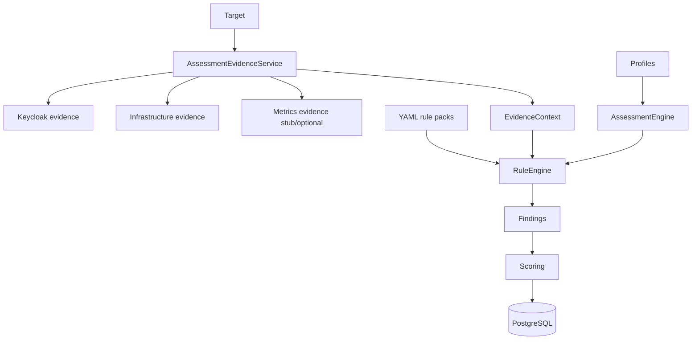

# Milestone 0.5 — Health Check & Assessment Depth

## Status

**COMPLETED**

| | |
|--|--|
| Version | `0.5.0-SNAPSHOT` |
| Commit | `a0ffe9b` — *Add health check engine and assessment depth (0.5).* |
| Build / tests | Commit message/CHANGELOG do not hardcode a test count. Conversation-era notes claimed **82** unit tests after 0.5 — **not verified from Git artifacts**; do not treat 82 as authoritative. Use HEAD baseline in [`../project-state.md`](../project-state.md). |

## Objective

Deepen **deterministic** assessments and health checks: target-aware evidence pipeline, declarative YAML rules, profiles, scoring/completeness/confidence, and a real health engine — so PASS/FAIL is never LLM-decided.

## Requirements

- FR-ASSESS-001 … FR-ASSESS-005
- FR-HEALTH-001, FR-HEALTH-002
- NFR-DET-001, NFR-RES-002
- ADR [0003](../adr/0003-deterministic-assessment-engine.md)

## Context

0.4 delivered real inventory. Assessments still needed richer Keycloak + infra evidence, operators/`appliesWhen`, profiles, and a proper health pipeline beyond Admin reachability.

## Scope

Verified in `a0ffe9b` / CHANGELOG `[0.5.0-SNAPSHOT]`:

- `AssessmentEvidenceService` orchestrating collectors
- `InfrastructureEvidenceCollector` (canonical inventory → evidence)
- Expanded `KeycloakEvidenceCollector` (realm/client depth)
- `AssessmentScope` / `EvidenceSubject` / finding subject-resource metadata
- Declarative rule engine: `ConditionEvaluator`, `DeclarativeRule`, operators, `appliesWhen`, `NOT_EVALUATED`
- YAML packs: HA (`openshift/ha.yaml`), security, production, capacity, admin-security; `rules/index.yaml`
- Scoring: category scores, evidence completeness, assessment confidence, COMPLETE/PARTIAL/FAILED status
- Assessment profiles + `AssessmentProfileResolver` (e.g. `rhbk-openshift-production-ha`)
- `HealthCheckEngine` + management health provider, Admin API, infra API, pod/workload checks
- MCP: `keycloak_run_assessment`, `keycloak_health_check`, list/get assessments, findings, profiles
- REST: `GET /api/v1/assessment-profiles`
- Flyway **V6** assessment depth columns
- Docs: health-check, assessment-profiles, rule-catalog, scoring

## Architecture



Health checks remain a **separate** pipeline (`HealthCheckEngine`). See [`../assessment-engine.md`](../architecture/assessment-engine.md), [`../health-check.md`](../health-check.md).

## Main Components

| Component | Responsibility |
|-----------|----------------|
| `AssessmentEvidenceService` | Collect/normalize evidence |
| `ConditionEvaluator` / `RuleEngine` | Declarative evaluation |
| `AssessmentScoring` | Scores, completeness, confidence |
| `ProfileRegistry` / resolver | Profile → packs |
| `HealthCheckEngine` | Component health orchestration |
| `AssessmentTools` | MCP assessment/health APIs |
| Flyway V6 | Persist depth metadata |

## MCP Changes

Added/expanded assessment & health tools (read-oriented execution that persists results):

- `keycloak_run_assessment`
- `keycloak_health_check`
- `keycloak_list_assessment_profiles`
- `keycloak_list_assessments` / `get_assessment` / `get_latest_assessment`
- `keycloak_get_findings`

## REST Changes

- Assessment profile listing
- Existing assessment/health history endpoints enriched with new summary fields

## Persistence Changes

- `V6__assessment_depth.sql` — completeness, confidence, category scores, rule counters, finding subject, health `duration_ms`

## Security Considerations

- Deterministic rules; LLM does not decide PASS/FAIL
- Sanitized persistence; PASS/SKIPPED/NOT_EVALUATED not stored as OPEN findings
- Target isolation tests for assessments
- Read-only ops posture retained

## Tests

Added/expanded in `a0ffe9b` (non-exhaustive):

- `ConditionEvaluatorTest`, `DeclarativeRuleValidationTest`, `RulePackFixtureTest`
- `MultiTargetAssessmentIsolationTest`, `AssessmentScoringTest`
- `HealthCheckEngineTest`

Do not invent a total count for this milestone alone.

## Acceptance Criteria

- [x] Target-aware evidence pipeline (Keycloak + infrastructure)
- [x] Declarative YAML rules with operators / `appliesWhen` / `NOT_EVALUATED`
- [x] Profiles and pack index
- [x] Scoring + completeness + confidence
- [x] HealthCheckEngine + management health provider
- [x] Assessment/health MCP tools
- [x] Flyway V6
- [x] Related docs and unit tests for engine/health

## Validation

```bash
mvn clean verify
```

## Known Limitations

- Metrics evidence still not a real Prometheus stack → **0.6**
- Management health needs configured management URL when used
- Opt-in Keycloak/RHBK ITs may be skipped
- Performance/SLO assessment deferred to **0.6**

## Deferred

- Prometheus / semantic metrics / performance rules → **0.6**
- Web UI → **0.7**

## Related Documentation

- [`../assessment-engine.md`](../architecture/assessment-engine.md)
- [`../assessment-profiles.md`](../assessment-profiles.md)
- [`../rule-catalog.md`](../rule-catalog.md)
- [`../scoring.md`](../scoring.md)
- [`../health-check.md`](../health-check.md)
- [`../evidence-catalog.md`](../evidence-catalog.md)

## Next Milestone

[0.6 — Prometheus Metrics](0.6-prometheus-metrics.md)
