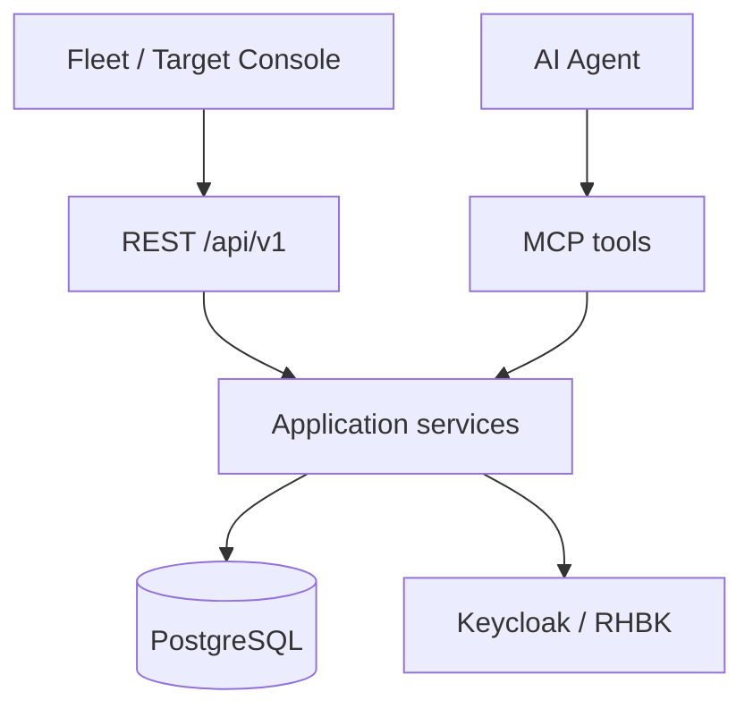

# UI architecture (conceptual)

The Operations Platform backend is UI-agnostic. A future console can consume:

## Suggested surfaces

1. **Fleet dashboard** — [docs/ui/fleet-dashboard.md](ui/fleet-dashboard.md)
2. **Target overview** — [docs/ui/target-overview.md](ui/target-overview.md)
3. **Assessment** — [docs/ui/assessment.md](ui/assessment.md)
4. **Infrastructure** — [docs/ui/infrastructure.md](ui/infrastructure.md)
5. **History** — [docs/ui/history.md](ui/history.md)
6. **Live events** — SSE `GET /api/v1/events` (server → browser; not for metric graphs)

## Future project

Prefer a separate repository / module `keycloak-operations-ui` (React + TypeScript). Do not mix a Node build into this Maven module unless productization requires it.

Authn/authz: see [identity-model.md](identity-model.md). REST and MCP must share `TargetAuthorizationService`.
