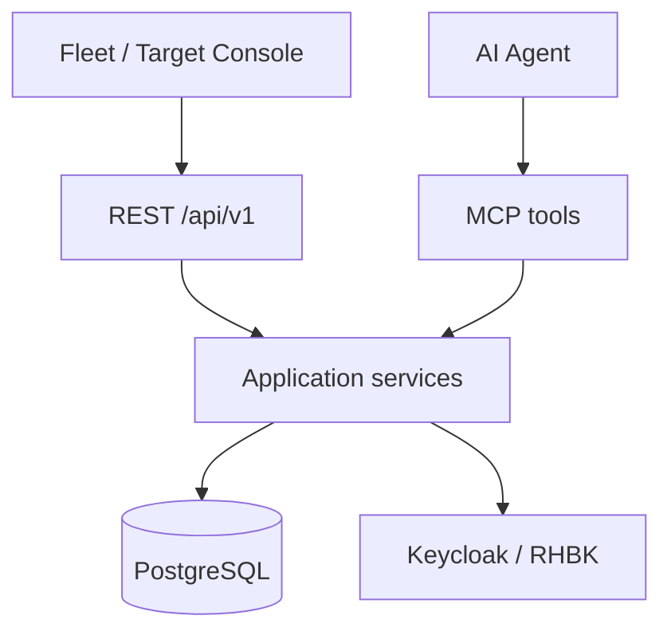

# UI architecture

The Operations Platform backend is UI-agnostic. The Fleet Operations Console consumes:

```mermaid
flowchart TB
  UI[Fleet / Target Console]
  API["REST /api/v1"]
  MCP[MCP tools]
  SVC[Application services]
  DB[(PostgreSQL)]
  KC[Keycloak / RHBK]

  UI --> API
  Agent[AI Agent] --> MCP
  API --> SVC
  MCP --> SVC
  SVC --> DB
  SVC --> KC
```

## Product direction: console plus optional assistant

The operator application remains a primary interface for inspection, assessment,
health, findings and reports without an LLM. An approved MCP client/model is an
additional question-driven interface, not a replacement for the console or a new
source of truth. [AGT2](milestones/agt2-access-aware-assistance.md) plans incremental
realm/client/user/policy views and grounded assistance over the same services and
fine-grained read policy. Same observation under equivalent principal/client/data-class/
disclosure context means equivalent facts in UI/REST/MCP; UI-visible PII may remain
unavailable to the model. New collections show their own timestamps. The first
`/configuration` screen now reads approved realm/client Boolean fields without
TargetLayout/Fleet overview access. Scope/session changes clear results, stale replies
are ignored and the API envelope is checked against the selected descriptor. No
automatic inspection, model, PII, health verdict or stored report is introduced.
Other domain views and optional embedded chat remain planned. See
[contract and limits](configuration-reads.md) and the
[shared architecture](architecture/access-aware-operations-assistant.md).

The [authenticated two-operator walkthrough](development/agt2-authenticated-operators-2026-09-19.md)
adds real Community IdP/provider evidence for this screen: disjoint catalogues,
exact facts, stale-pin errors with previous results cleared, empty Fleet/direct-target
denial, keyboard inspection and logout/account switch. No model or product UI change;
this is not full accessibility, revocation, RHBK or multi-domain acceptance.

## Module layout

In-repo frontend: [`ui/`](../ui/) (React + TypeScript + Vite; Node 24 LTS recommended, with supported engines in `ui/package.json`). CI and the static-image build stage select Node 24; no workstation-global runtime selection is required.

Production packaging: **separate nginx static image** (`ui/Dockerfile`). The Quarkus distribution does **not** embed UI assets — backend remains the security boundary; UI pods have no assessor ServiceAccount.

OpenShift manifests: `deploy/openshift/100-ui-deployment.yaml`, `110-ui-service.yaml`, `120-ui-route.yaml`.

## Surfaces

1. **Fleet dashboard** — `GET /api/v1/fleet`
2. **Target overview** — `GET /api/v1/targets/{targetId}/overview`
3. **Health / Assessment / Performance / Infrastructure / History** — existing `/api/v1` resources
4. **Live events** — SSE `GET /api/v1/events` (assessment/health completed; not metric graphs)
5. **Operations report** — on-demand JSON/Markdown through the shared report service
6. **Installation** — existing-target discovery/review/confirmation, explicit permissions and mandatory audit

Conceptual UX notes remain under [`ui/`](ui/).

## Authn/authz

See [identity-model.md](identity-model.md). REST and MCP share `TargetAuthorizationService`. Packaged backend access fails closed; only explicit local-lab/dev/test is unauthenticated. The UI supports OIDC authorization code + PKCE S256, in-memory tokens, refresh and authenticated SSE. Bounded local browser/IdP evidence is recorded below; broader H1/D1 and production identity acceptance remain open. Frontend guards never replace backend authorization.

REST and SSE now share a local session-generation boundary. Provider changes abort
old transports and generation checks reject late credentials/responses/events; streams
cannot reconnect across identities. Current 401 invalidates the local session and
unmounts protected content, while target 403 preserves authentication. Logout and
initialization cleanup use the same invalidation path. This does not revoke issued
JWTs or roll back server-side work; other-tab/IdP logout remains refresh-detected.
See the [session evidence and limits](development/d1-browser-session-2026-09-19.md).

The [browser-negative fixture](../dev/ui-browser-negatives/README.md) imports the
actual production entry/AuthProvider/adapter/client and observes only exact `/me`
requests. Fixed-JWKS signature verification and issuer/audience/expiry booleans are
displayed without token material. The only injected fault is a bounded expiry delay;
requests and backend responses are native. This entry is outside production builds.
[Local evidence](development/d1-browser-negatives-2026-09-19.md) records three native
401s with protected UI removed and a valid 200/scoped-Fleet control. Combined with
prior session evidence, the bounded D1 browser criterion is met; H1/D1 acceptance,
independent operator reproduction and production integration remain separate.

## Change navigation lifetime

`ChangeDetailPage` keys its stateful detail by route change ID. Each visit owns its
read/action generation, including error and completion handlers; leaving and returning
to the same ID does not revive the old visit. Reload clears data and controls, and a
synchronous in-flight guard rejects duplicate actions. GET responses must match the
route ID; action responses must also match the original record's target ID.

`ChangesPage` keeps its filter toolbar mounted while keying results by target/status.
Removing the target unmounts results and never performs an unscoped list request.
Each request/retry owns a generation; a page containing any foreign-target record is
rejected, not silently filtered. Secondary buttons reuse the established readable
style, and status filters expose `aria-pressed` without losing focus on refresh.

These presentation checks supplement backend authorization; they neither cancel nor
roll back server-side actions, and are separate from authentication generations.
The [navigation ledger](development/d1-change-navigation-2026-09-19.md) records unit
regressions and browser observations against an explicitly [synthetic fixture](../dev/ui-change-navigation/README.md),
not live write or OIDC acceptance.
